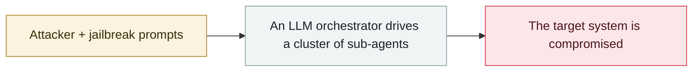

# HexStrike-AI turned on a Citrix zero-day

     

## Summary

Check Point: within hours of the open-source AI attack framework's release, dark-web discussions appeared about using it to mass-exploit NetScaler vulnerabilities (including the zero-day **CVE-2025-7775**). **150 autonomous agents finished the exploitation within 10 minutes**, and some immediately resold the compromised devices

## Attack chain

## Sources

| # | Source | Link |
|---|---|---|
| 1 | Check Point | <https://blog.checkpoint.com/executive-insights/hexstrike-ai-when-llms-meet-zero-day-exploitation/> |
| 2 | THN | <https://thehackernews.com/2025/09/threat-actors-weaponize-hexstrike-ai-to.html> |

## Metadata

| Field | Value |
|---|---|
| Date | `2025-09-02` (raw: 2025-09-02, precision `day`) |
| Kind | Incident `incident` |
| Type | [`WEAPON`](../../taxonomy/types.md#weapon) Agent used as a weapon |
| Severity | **High** `high` |
| Confidence | **A** — primary source (vendor / victim / law enforcement / official report) |
| Real harm | Yes |
| AI involvement | Confirmed `confirmed` |
| Region | [Global](../../regions/global.md) |
| Archive ID | `2025-09-02-hexstrike-citrix-day` |

**Why this classification:** Real incident with a confirmed victim. Rated `high`: real damage is limited in scope, or it is a CVSS 9+ severe flaw, or a capability demonstration of significance. Grading criteria: see [taxonomy/severity.md](../../taxonomy/severity.md) and [taxonomy/confidence.md](../../taxonomy/confidence.md).

## Related

**Topic:** [Offensive AI capability evolution](../../topics/offensive-ai.md)

**Related records:**

- `2025-09-01` [Villager (Cyberspike) AI pentest tool](2025-09-01-villager-cyberspike-shen-tou-gong.md)   Villager (Cyberspike) AI pentest tool
- `2025-09-15` [Anthropic detects GTG-1002](2025-09-15-anthropic-gtg-jian-ce-dao.md)   Anthropic detects GTG-1002
- `2025-08-26` [ESET finds PromptLock](../2025-08/2025-08-26-eset-promptlock-fa-xian.md)   ESET finds PromptLock
- `2025-08-27` [Anthropic August threat report](../2025-08/2025-08-27-anthropic-ba-wei-xie-bao.md)   Anthropic August threat report

---

[← 2025-09 index](README.md) · [← All records](../../README.md) · [Chinese](../i18n/zh/2025-09/2025-09-02-hexstrike-citrix-day.md)

This record is part of the **Orca AI Incident Archive**, licensed [CC BY 4.0](../../LICENSE). Found a factual error or a missing source? [Open an issue or PR](../../CONTRIBUTING.md) — corrections are recorded in the record's revision history, never silently overwritten.
