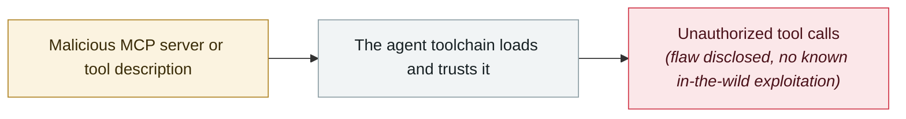

# Claude Code MCP auto-enable bypass

     

## Summary

CVE-2025-59536 (published 2025-10-03): a project-level `.mcp.json` setting `enableAllProjectMcpServers: true` silently activates attacker endpoints; fixed 09-22

## Attack chain

## Sources

| # | Source | Link |
|---|---|---|
| 1 | Check Point | <https://research.checkpoint.com/2026/rce-and-api-token-exfiltration-through-claude-code-project-files-cve-2025-59536/> |

## Metadata

| Field | Value |
|---|---|
| Date | `2025-09-03` (raw: 2025-09-03, precision `day`) |
| Kind | Vulnerability disclosure `vulnerability` |
| Type | [`MCP`](../../taxonomy/types.md#mcp) MCP & tool-chain |
| Severity | **High** `high` |
| Confidence | **A** — primary source (vendor / victim / law enforcement / official report) |
| Real harm | No |
| AI involvement | Confirmed `confirmed` |
| Region | [Global](../../regions/global.md) |
| Archive ID | `2025-09-03-claude-code-mcp` |

**Why this classification:** Vulnerability disclosure; as of archiving there is no evidence of in-the-wild exploitation, so `real_harm: false`. Rated `high`: real damage is limited in scope, or it is a CVSS 9+ severe flaw, or a capability demonstration of significance. Grading criteria: see [taxonomy/severity.md](../../taxonomy/severity.md) and [taxonomy/confidence.md](../../taxonomy/confidence.md).

## Related

**Topic:** [Agent supply-chain poisoning](../../topics/agent-supply-chain.md)

**Related records:**

- `2025-09-25` [postmark-mcp malicious npm package](2025-09-25-postmark-mcp-npm.md)   postmark-mcp malicious npm package
- `2025-08-05` [Cursor MCPoison (CVE-2025-54136)](../2025-08/2025-08-05-cursor-mcpoison.md)   Cursor MCPoison (CVE-2025-54136)
- `2025-10-22` [Shadow Escape: first zero-click agent attack over MCP](../2025-10/2025-10-22-shadow-escape-mcp-agent.md)   Shadow Escape: first zero-click agent attack over MCP
- `2025-10-01` [Framelink Figma MCP RCE](../2025-10/2025-10-01-framelink-figma-mcp-rce.md)   Framelink Figma MCP RCE

---

[← 2025-09 index](README.md) · [← All records](../../README.md) · [Chinese](../i18n/zh/2025-09/2025-09-03-claude-code-mcp.md)

This record is part of the **Orca AI Incident Archive**, licensed [CC BY 4.0](../../LICENSE). Found a factual error or a missing source? [Open an issue or PR](../../CONTRIBUTING.md) — corrections are recorded in the record's revision history, never silently overwritten.
