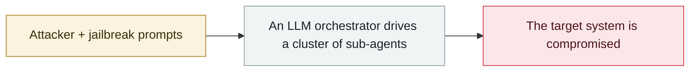

# Anthropic detects GTG-1002

     

## Summary

Anthropic detected the GTG-1002 campaign internally in mid-September, then spent 10 days investigating while banning accounts and notifying victims, and only went public on 11-13.

## Attack chain

## Sources

| # | Source | Link |
|---|---|---|
| 1 | Anthropic PDF | <https://www-cdn.anthropic.com/d7dd50dd1185f59be051b307150d877f2b82bd2c.pdf> |

## Metadata

| Field | Value |
|---|---|
| Date | `2025-09-15` (raw: mid 2025-09, precision `part`) |
| Kind | Incident `incident` |
| Type | [`WEAPON`](../../taxonomy/types.md#weapon) Agent used as a weapon |
| Severity | **Medium** `medium` |
| Confidence | **A** — primary source (vendor / victim / law enforcement / official report) |
| Real harm | No |
| AI involvement | Confirmed `confirmed` |
| Region | [Global](../../regions/global.md) |
| Archive ID | `2025-09-15-anthropic-gtg-jian-ce-dao` |

**Why this classification:** Real incident without a confirmed specific victim. Rated `medium`: controlled demo, moderate flaw, or an incident limited to a single user / single machine. Grading criteria: see [taxonomy/severity.md](../../taxonomy/severity.md) and [taxonomy/confidence.md](../../taxonomy/confidence.md).

## Related

**Topic:** [Offensive AI capability evolution](../../topics/offensive-ai.md)

**Related records:**

- `2025-09-02` [HexStrike-AI turned on a Citrix zero-day](2025-09-02-hexstrike-citrix-day.md)   HexStrike-AI turned on a Citrix zero-day
- `2025-09-01` [Villager (Cyberspike) AI pentest tool](2025-09-01-villager-cyberspike-shen-tou-gong.md)   Villager (Cyberspike) AI pentest tool
- `2025-08-26` [ESET finds PromptLock](../2025-08/2025-08-26-eset-promptlock-fa-xian.md)   ESET finds PromptLock
- `2025-08-27` [Anthropic August threat report](../2025-08/2025-08-27-anthropic-ba-wei-xie-bao.md)   Anthropic August threat report

---

[← 2025-09 index](README.md) · [← All records](../../README.md) · [Chinese](../i18n/zh/2025-09/2025-09-15-anthropic-gtg-jian-ce-dao.md)

This record is part of the **Orca AI Incident Archive**, licensed [CC BY 4.0](../../LICENSE). Found a factual error or a missing source? [Open an issue or PR](../../CONTRIBUTING.md) — corrections are recorded in the record's revision history, never silently overwritten.
