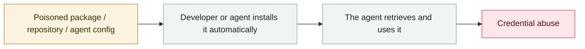

# Shai-Hulud npm worm v1

      

## Summary

**The first successful self-propagating attack in the npm ecosystem**. The postinstall script harvests secrets and exfiltrates them to public GitHub repositories the attackers created (named Shai-Hulud). CISA issued an alert on 09-23; **500+ packages** were affected. The theft targets explicitly include GitHub PATs, AWS/GCP/Azure keys, `ANTHROPIC_API_KEY`, Claude Code configs and `.mcp.json`. Wiz assesses it as sharing the same origin as s1ngularity

## Attack chain

## Sources

| # | Source | Link |
|---|---|---|
| 1 | Wiz | <https://www.wiz.io/blog/shai-hulud-npm-supply-chain-attack> |
| 2 | CISA | <https://www.cisa.gov/news-events/alerts/2025/09/23/widespread-supply-chain-compromise-impacting-npm-ecosystem> |

## Metadata

| Field | Value |
|---|---|
| Date | `2025-09-15` (raw: 2025-09-15, precision `day`) |
| Kind | Incident `incident` |
| Type | [`SUPPLY`](../../taxonomy/types.md#supply) Supply-chain poisoning · [`CRED`](../../taxonomy/types.md#cred) Credential abuse |
| Severity | **Critical** `critical` |
| Confidence | **A** — primary source (vendor / victim / law enforcement / official report) |
| Real harm | Yes |
| AI involvement | Confirmed `confirmed` |
| Region | [Global](../../regions/global.md) |
| Archive ID | `2025-09-15-shai-hulud-npm` |

**Why this classification:** Real incident with a confirmed victim. Rated `critical`: confirmed real damage at the multi-organization / government / critical-infrastructure / supply-chain-worm level, or a first-of-its-kind capability milestone with real victims. Grading criteria: see [taxonomy/severity.md](../../taxonomy/severity.md) and [taxonomy/confidence.md](../../taxonomy/confidence.md).

## Related

**Topic:** [Agent supply-chain poisoning](../../topics/agent-supply-chain.md)

**Related records:**

- `2025-09-25` [postmark-mcp malicious npm package](2025-09-25-postmark-mcp-npm.md)   postmark-mcp malicious npm package
- `2025-08-08` [Salesloft Drift OAuth token theft](../2025-08/2025-08-08-salesloft-drift-oauth-theft.md)   Salesloft Drift OAuth token theft
- `2025-08-26` [Nx "s1ngularity"](../2025-08/2025-08-26-nx-s1ngularity.md)   Nx "s1ngularity"
- `2025-08-28` [TransUnion leaks 4.4-4.5M people via a third-party app](../2025-08/2025-08-28-transunion-jing-di-san-fang.md)   TransUnion leaks 4.4-4.5M people via a third-party app

---

[← 2025-09 index](README.md) · [← All records](../../README.md) · [Chinese](../i18n/zh/2025-09/2025-09-15-shai-hulud-npm.md)

This record is part of the **Orca AI Incident Archive**, licensed [CC BY 4.0](../../LICENSE). Found a factual error or a missing source? [Open an issue or PR](../../CONTRIBUTING.md) — corrections are recorded in the record's revision history, never silently overwritten.
