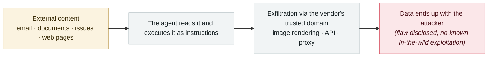

# ForcedLeak (Salesforce Agentforce)

      

## Summary

Noma Security, **CVSS 9.4**. All an attacker needs is a public Web-to-Lead form plus **$5** to buy up an **expired Salesforce CSP allow-listed domain**, and they can exfiltrate any Agentforce organization's CRM data with zero interaction

## Attack chain

## Sources

| # | Source | Link |
|---|---|---|
| 1 | Noma Security | <https://noma.security/blog/forcedleak-agent-risks-exposed-in-salesforce-agentforce> |

## Metadata

| Field | Value |
|---|---|
| Date | `2025-09-25` (raw: 2025-09-25, precision `day`) |
| Kind | Vulnerability disclosure `vulnerability` |
| Type | [`IPI`](../../taxonomy/types.md#ipi) Indirect prompt injection · [`EXFIL`](../../taxonomy/types.md#exfil) Data exfiltration |
| Severity | **High** `high` |
| Confidence | **A** — primary source (vendor / victim / law enforcement / official report) |
| Real harm | No |
| AI involvement | Confirmed `confirmed` |
| Region | [Global](../../regions/global.md) |
| Archive ID | `2025-09-25-forcedleak-salesforce-agentforce` |

**Why this classification:** Vulnerability disclosure; as of archiving there is no evidence of in-the-wild exploitation, so `real_harm: false`. Rated `high`: real damage is limited in scope, or it is a CVSS 9+ severe flaw, or a capability demonstration of significance. Grading criteria: see [taxonomy/severity.md](../../taxonomy/severity.md) and [taxonomy/confidence.md](../../taxonomy/confidence.md).

## Related

**Topic:** [Zero-click data exfiltration chain](../../topics/zero-click-exfil.md)

**Related records:**

- `2025-09-18` [ShadowLeak](2025-09-18-shadowleak.md)   ShadowLeak
- `2025-09-19` [Notion 3.0 agent hits the lethal trifecta](2025-09-19-notion-agent-zhi-ming-san.md)   Notion 3.0 agent hits the lethal trifecta
- `2025-09-30` [Gemini "Trifecta"](2025-09-30-gemini-trifecta.md)   Gemini "Trifecta"
- `2025-08-06` [AgentFlayer zero-click attack set (Black Hat USA)](../2025-08/2025-08-06-agentflayer-black-hat-usa.md)   AgentFlayer zero-click attack set (Black Hat USA)

---

[← 2025-09 index](README.md) · [← All records](../../README.md) · [Chinese](../i18n/zh/2025-09/2025-09-25-forcedleak-salesforce-agentforce.md)

This record is part of the **Orca AI Incident Archive**, licensed [CC BY 4.0](../../LICENSE). Found a factual error or a missing source? [Open an issue or PR](../../CONTRIBUTING.md) — corrections are recorded in the record's revision history, never silently overwritten.
