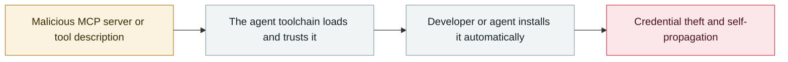

# postmark-mcp malicious npm package

      

## Summary

**The first malicious MCP server in the wild**. Koi Security: starting with version 15, a single line of code silently BCC'd all passing emails to the author — an estimated **15,000 messages a day**

## Attack chain

## Sources

| # | Source | Link |
|---|---|---|
| 1 | Koi Security | <https://www.koi.ai/blog> |

## Metadata

| Field | Value |
|---|---|
| Date | `2025-09-25` (raw: 2025-09-25, precision `day`) |
| Kind | Incident `incident` |
| Type | [`MCP`](../../taxonomy/types.md#mcp) MCP & tool-chain · [`SUPPLY`](../../taxonomy/types.md#supply) Supply-chain poisoning |
| Severity | **High** `high` |
| Confidence | **A** — primary source (vendor / victim / law enforcement / official report) |
| Real harm | Yes |
| AI involvement | Confirmed `confirmed` |
| Region | [Global](../../regions/global.md) |
| Archive ID | `2025-09-25-postmark-mcp-npm` |

**Why this classification:** Real incident with a confirmed victim. Rated `high`: real damage is limited in scope, or it is a CVSS 9+ severe flaw, or a capability demonstration of significance. Grading criteria: see [taxonomy/severity.md](../../taxonomy/severity.md) and [taxonomy/confidence.md](../../taxonomy/confidence.md).

## Related

**Topic:** [Agent supply-chain poisoning](../../topics/agent-supply-chain.md)

**Related records:**

- `2025-09-15` [Shai-Hulud npm worm v1](2025-09-15-shai-hulud-npm.md)   Shai-Hulud npm worm v1
- `2025-09-03` [Claude Code MCP auto-enable bypass](2025-09-03-claude-code-mcp.md)   Claude Code MCP auto-enable bypass
- `2025-08-08` [Salesloft Drift OAuth token theft](../2025-08/2025-08-08-salesloft-drift-oauth-theft.md)   Salesloft Drift OAuth token theft
- `2025-08-26` [Nx "s1ngularity"](../2025-08/2025-08-26-nx-s1ngularity.md)   Nx "s1ngularity"

---

[← 2025-09 index](README.md) · [← All records](../../README.md) · [Chinese](../i18n/zh/2025-09/2025-09-25-postmark-mcp-npm.md)

This record is part of the **Orca AI Incident Archive**, licensed [CC BY 4.0](../../LICENSE). Found a factual error or a missing source? [Open an issue or PR](../../CONTRIBUTING.md) — corrections are recorded in the record's revision history, never silently overwritten.
