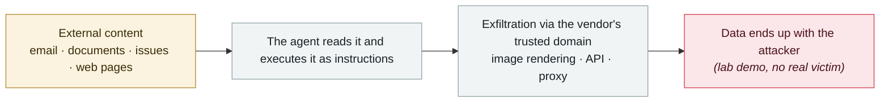

# Gemini "Trifecta"

      

## Summary

Tenable's three chains: ① search injection in the Search Personalization model ② **log-to-prompt injection** in Gemini Cloud Assist ③ the Browsing tool exfiltrating saved information and location. Google has fixed all of them (rolled back the vulnerable model, stopped rendering malicious hyperlinks, deployed layered prompt-injection defenses)

## Attack chain

## Sources

| # | Source | Link |
|---|---|---|
| 1 | Tenable | <https://www.tenable.com/blog/the-trifecta-how-three-new-gemini-vulnerabilities-in-cloud-assist-search-model-and-browsing> |
| 2 | THN | <https://thehackernews.com/2025/09/researchers-disclose-google-gemini-ai.html> |

## Metadata

| Field | Value |
|---|---|
| Date | `2025-09-30` (raw: 2025-09-30, precision `day`) |
| Kind | Research demo `research` |
| Type | [`IPI`](../../taxonomy/types.md#ipi) Indirect prompt injection · [`EXFIL`](../../taxonomy/types.md#exfil) Data exfiltration |
| Severity | **Medium** `medium` |
| Confidence | **A** — primary source (vendor / victim / law enforcement / official report) |
| Real harm | No |
| AI involvement | Confirmed `confirmed` |
| Region | [Global](../../regions/global.md) |
| Archive ID | `2025-09-30-gemini-trifecta` |

**Why this classification:** Controlled demo by a research lab or vendor, `real_harm: false`; the record marks when the attack surface became public. Rated `medium`: controlled demo, moderate flaw, or an incident limited to a single user / single machine. Grading criteria: see [taxonomy/severity.md](../../taxonomy/severity.md) and [taxonomy/confidence.md](../../taxonomy/confidence.md).

## Related

**Topic:** [Zero-click data exfiltration chain](../../topics/zero-click-exfil.md)

**Related records:**

- `2025-09-18` [ShadowLeak](2025-09-18-shadowleak.md)   ShadowLeak
- `2025-09-19` [Notion 3.0 agent hits the lethal trifecta](2025-09-19-notion-agent-zhi-ming-san.md)   Notion 3.0 agent hits the lethal trifecta
- `2025-09-25` [ForcedLeak (Salesforce Agentforce)](2025-09-25-forcedleak-salesforce-agentforce.md)   ForcedLeak (Salesforce Agentforce)
- `2025-08-06` [AgentFlayer zero-click attack set (Black Hat USA)](../2025-08/2025-08-06-agentflayer-black-hat-usa.md)   AgentFlayer zero-click attack set (Black Hat USA)

---

[← 2025-09 index](README.md) · [← All records](../../README.md) · [Chinese](../i18n/zh/2025-09/2025-09-30-gemini-trifecta.md)

This record is part of the **Orca AI Incident Archive**, licensed [CC BY 4.0](../../LICENSE). Found a factual error or a missing source? [Open an issue or PR](../../CONTRIBUTING.md) — corrections are recorded in the record's revision history, never silently overwritten.
