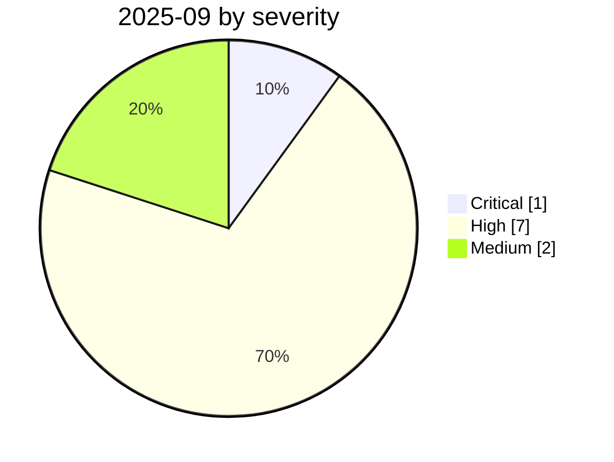

# 2025-09

<!-- BEGIN:summary -->
**10** records

   

## Records this month

| Date | Record | Type | Severity | Confidence | Real harm |
|---|---|---|---|---|---|
| `09-01` | [Villager (Cyberspike) AI pentest tool](2025-09-01-villager-cyberspike-shen-tou-gong.md) | `WEAPON` | **High** | A | ✅ |
| `09-02` | [HexStrike-AI turned on a Citrix zero-day](2025-09-02-hexstrike-citrix-day.md) | `WEAPON` | **High** | A | ✅ |
| `09-03` | [Claude Code MCP auto-enable bypass](2025-09-03-claude-code-mcp.md) | `MCP` | **High** | A | — |
| `09-15` | ★ [Shai-Hulud npm worm v1](2025-09-15-shai-hulud-npm.md) | `SUPPLY` `CRED` | **Critical** | A | ✅ |
| `09-15` | [Anthropic detects GTG-1002](2025-09-15-anthropic-gtg-jian-ce-dao.md) | `WEAPON` | Medium | A | — |
| `09-18` | [ShadowLeak](2025-09-18-shadowleak.md) | `IPI` `EXFIL` | **High** | A | — |
| `09-19` | [Notion 3.0 agent hits the lethal trifecta](2025-09-19-notion-agent-zhi-ming-san.md) | `IPI` `EXFIL` | **High** | A | — |
| `09-25` | [ForcedLeak (Salesforce Agentforce)](2025-09-25-forcedleak-salesforce-agentforce.md) | `IPI` `EXFIL` | **High** | A | — |
| `09-25` | [postmark-mcp malicious npm package](2025-09-25-postmark-mcp-npm.md) | `MCP` `SUPPLY` | **High** | A | ✅ |
| `09-30` | [Gemini "Trifecta"](2025-09-30-gemini-trifecta.md) | `IPI` `EXFIL` | Medium | A | — |

★ = `critical` · ⚠️ = disputed facts or attribution · real harm: ✅ confirmed victim / — none / · not applicable (policy and intelligence reports)
<!-- END:summary -->

<!-- BEGIN:nav -->
---

[← 2025-08](../2025-08/README.md) · [Archive index](../../README.md) · [By type](../../taxonomy/types.md) · [2025-10 →](../2025-10/README.md)
<!-- END:nav -->
