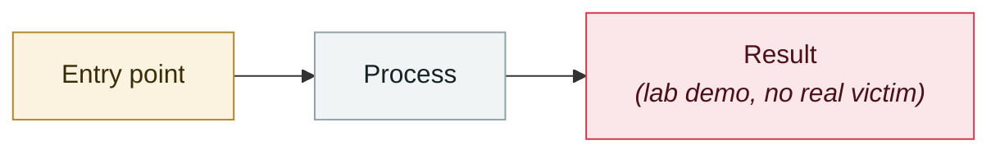

# OpenAI Guardrails broken days after launch

     

## Summary

HiddenLayer: the new framework's LLM judge can itself be prompt-injected

## Attack chain

## Sources

| # | Source | Link |
|---|---|---|
| 1 | Security Reference 2025 roundup | <https://www.secrss.com/articles/86614> |

## Metadata

| Field | Value |
|---|---|
| Date | `2025-10-01` (raw: 2025-10, precision `month`) |
| Kind | Research demo `research` |
| Type | [`OTHER`](../../taxonomy/types.md#other) Other |
| Severity | **Medium** `medium` |
| Confidence | **B** — research lab or major outlet with checkable detail |
| Real harm | No |
| AI involvement | Confirmed `confirmed` |
| Region | [Global](../../regions/global.md) |
| Archive ID | `2025-10-01-guardrails-kuang-jia-xian-shu` |

**Why this classification:** Controlled demo by a research lab or vendor, `real_harm: false`; the record marks when the attack surface became public. Rated `medium`: controlled demo, moderate flaw, or an incident limited to a single user / single machine. Grading criteria: see [taxonomy/severity.md](../../taxonomy/severity.md) and [taxonomy/confidence.md](../../taxonomy/confidence.md).

---

[← 2025-10 index](README.md) · [← All records](../../README.md) · [Chinese](../i18n/zh/2025-10/2025-10-01-guardrails-kuang-jia-xian-shu.md)

This record is part of the **Orca AI Incident Archive**, licensed [CC BY 4.0](../../LICENSE). Found a factual error or a missing source? [Open an issue or PR](../../CONTRIBUTING.md) — corrections are recorded in the record's revision history, never silently overwritten.
