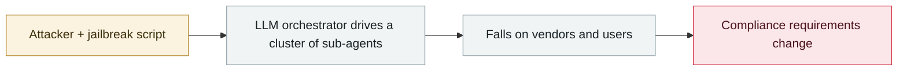

# OpenAI October threat report

      

## Summary

Has cumulatively disrupted **40+ networks** since 2024-02; discloses a China-government-related social media monitoring proposal and scam networks in Cambodia/Myanmar/Nigeria. Core judgment: **attackers are speeding up old playbooks by plugging in AI, not gaining new attack capabilities**

## Attack chain

## Sources

| # | Source | Link |
|---|---|---|
| 1 | OpenAI | <https://openai.com/global-affairs/disrupting-malicious-uses-of-ai-october-2025/> |
| 2 | PDF | <https://cdn.openai.com/threat-intelligence-reports/7d662b68-952f-4dfd-a2f2-fe55b041cc4a/disrupting-malicious-uses-of-ai-october-2025.pdf> |

## Metadata

| Field | Value |
|---|---|
| Date | `2025-10-07` (raw: 2025-10-07, precision `day`) |
| Kind | Threat report `report` |
| Type | [`WEAPON`](../../taxonomy/types.md#weapon) Agent used as a weapon · [`GOV`](../../taxonomy/types.md#gov) Governance & policy |
| Severity | **Info** `info` |
| Confidence | **A** — primary source (vendor / victim / law enforcement / official report) |
| Real harm | n/a |
| AI involvement | Confirmed `confirmed` |
| Region | [Global](../../regions/global.md) |
| Archive ID | `2025-10-07-shi-wei-xie-bao-gao` |

**Why this classification:** Threat intelligence report covering several incidents; it is not counted as a single incident itself, so `severity` is recorded as `info`. Grading criteria: see [taxonomy/severity.md](../../taxonomy/severity.md) and [taxonomy/confidence.md](../../taxonomy/confidence.md).

## Related

**Topic:** [Offensive AI capability evolution](../../topics/offensive-ai.md) · [Defense & governance](../../topics/defense.md)

**Related records:**

- `2025-10-21` [OpenAI launches the Atlas browser](2025-10-21-atlas-liu-lan-qi-fa.md)   OpenAI launches the Atlas browser
- `2025-11-13` [GTG-1002: first AI-orchestrated cyber-espionage campaign](../2025-11/2025-11-13-gtg-1002-first-ai-orchestrated-espionage.md)   GTG-1002: first AI-orchestrated cyber-espionage campaign
- `2025-09-02` [HexStrike-AI turned on a Citrix zero-day](../2025-09/2025-09-02-hexstrike-citrix-day.md)   HexStrike-AI turned on a Citrix zero-day
- `2025-09-01` [Villager (Cyberspike) AI pentest tool](../2025-09/2025-09-01-villager-cyberspike-shen-tou-gong.md)   Villager (Cyberspike) AI pentest tool

---

[← 2025-10 index](README.md) · [← All records](../../README.md) · [Chinese](../i18n/zh/2025-10/2025-10-07-shi-wei-xie-bao-gao.md)

This record is part of the **Orca AI Incident Archive**, licensed [CC BY 4.0](../../LICENSE). Found a factual error or a missing source? [Open an issue or PR](../../CONTRIBUTING.md) — corrections are recorded in the record's revision history, never silently overwritten.
