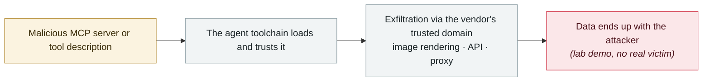

# Shadow Escape: first zero-click agent attack over MCP

      

## Summary

Disclosed by Operant AI. **No user mistake, phishing or malicious extension required** — it exploits the trust an agent already holds through legitimate MCP connections to invisibly exfiltrate data across major platforms including ChatGPT, Claude and Gemini, including Social Security and medical record numbers

## Attack chain

## Sources

| # | Source | Link |
|---|---|---|
| 1 | Operant AI | <https://www.operant.ai/art-kubed/shadow-escape> |
| 2 | GlobeNewswire | <https://www.globenewswire.com/news-release/2025/10/22/3171164/0/en/Operant-AI-Discovers-Shadow-Escape-The-First-Zero-Click-Agentic-Attack-via-MCP.html> |

## Metadata

| Field | Value |
|---|---|
| Date | `2025-10-22` (raw: 2025-10-22, precision `day`) |
| Kind | Research demo `research` |
| Type | [`MCP`](../../taxonomy/types.md#mcp) MCP & tool-chain · [`EXFIL`](../../taxonomy/types.md#exfil) Data exfiltration |
| Severity | **High** `high` |
| Confidence | **A** — primary source (vendor / victim / law enforcement / official report) |
| Real harm | No |
| AI involvement | Confirmed `confirmed` |
| Region | [Global](../../regions/global.md) |
| Archive ID | `2025-10-22-shadow-escape-mcp-agent` |

**Why this classification:** Controlled demo by a research lab or vendor, `real_harm: false`; the record marks when the attack surface became public. Rated `high`: real damage is limited in scope, or it is a CVSS 9+ severe flaw, or a capability demonstration of significance. Grading criteria: see [taxonomy/severity.md](../../taxonomy/severity.md) and [taxonomy/confidence.md](../../taxonomy/confidence.md).

## Related

**Topic:** [Agent supply-chain poisoning](../../topics/agent-supply-chain.md) · [Zero-click data exfiltration chain](../../topics/zero-click-exfil.md)

**Related records:**

- `2025-10-02` [CometJacking](2025-10-02-cometjacking.md)   CometJacking
- `2025-10-08` [CamoLeak (GitHub Copilot Chat)](2025-10-08-camoleak-github-copilot-chat.md)   CamoLeak (GitHub Copilot Chat)
- `2025-10-01` [Framelink Figma MCP RCE](2025-10-01-framelink-figma-mcp-rce.md)   Framelink Figma MCP RCE
- `2025-09-03` [Claude Code MCP auto-enable bypass](../2025-09/2025-09-03-claude-code-mcp.md)   Claude Code MCP auto-enable bypass

---

[← 2025-10 index](README.md) · [← All records](../../README.md) · [Chinese](../i18n/zh/2025-10/2025-10-22-shadow-escape-mcp-agent.md)

This record is part of the **Orca AI Incident Archive**, licensed [CC BY 4.0](../../LICENSE). Found a factual error or a missing source? [Open an issue or PR](../../CONTRIBUTING.md) — corrections are recorded in the record's revision history, never silently overwritten.
