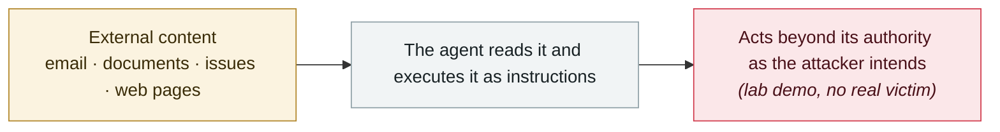

# Atlas "poisoned memory"

     

## Summary

LayerX: via CSRF, malicious instructions are written into ChatGPT's persistent memory and **survive across sessions**

## Attack chain

## Sources

| # | Source | Link |
|---|---|---|
| 1 | Wiz year-end review | <https://www.wiz.io/blog/agentic-browser-security-2025-year-end-review> |

## Metadata

| Field | Value |
|---|---|
| Date | `2025-10-27` (raw: 2025-10-27, precision `day`) |
| Kind | Research demo `research` |
| Type | [`IPI`](../../taxonomy/types.md#ipi) Indirect prompt injection |
| Severity | **Medium** `medium` |
| Confidence | **B** — research lab or major outlet with checkable detail |
| Real harm | No |
| AI involvement | Confirmed `confirmed` |
| Region | [Global](../../regions/global.md) |
| Archive ID | `2025-10-27-atlas-wu-ran-ji-yi` |

**Why this classification:** Controlled demo by a research lab or vendor, `real_harm: false`; the record marks when the attack surface became public. Rated `medium`: controlled demo, moderate flaw, or an incident limited to a single user / single machine. Grading criteria: see [taxonomy/severity.md](../../taxonomy/severity.md) and [taxonomy/confidence.md](../../taxonomy/confidence.md).

## Related

**Topic:** [Zero-click data exfiltration chain](../../topics/zero-click-exfil.md)

**Related records:**

- `2025-10-02` [CometJacking](2025-10-02-cometjacking.md)   CometJacking
- `2025-10-08` [CamoLeak (GitHub Copilot Chat)](2025-10-08-camoleak-github-copilot-chat.md)   CamoLeak (GitHub Copilot Chat)
- `2025-10-31` [Agent Session Smuggling: agents deceiving agents over A2A](2025-10-31-agent-session-smuggling-a2a.md)   Agent Session Smuggling: agents deceiving agents over A2A
- `2025-10-21` [Brave discloses screenshot-based injection in Comet](2025-10-21-brave-comet-pi-lu-jie.md)   Brave discloses screenshot-based injection in Comet

---

[← 2025-10 index](README.md) · [← All records](../../README.md) · [Chinese](../i18n/zh/2025-10/2025-10-27-atlas-wu-ran-ji-yi.md)

This record is part of the **Orca AI Incident Archive**, licensed [CC BY 4.0](../../LICENSE). Found a factual error or a missing source? [Open an issue or PR](../../CONTRIBUTING.md) — corrections are recorded in the record's revision history, never silently overwritten.
