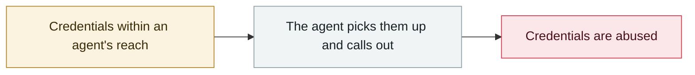

# Claude Code API key exfiltration

     

## Summary

A malicious `ANTHROPIC_BASE_URL` in `.claude/settings.json` routes authenticated traffic to an attacker's proxy, **before the trust prompt ever appears**. CVE-2026-21852 (disclosed 2026-01-21), **fixed 2025-12-28**

## Attack chain

## Sources

| # | Source | Link |
|---|---|---|
| 1 | Check Point | <https://research.checkpoint.com/2026/rce-and-api-token-exfiltration-through-claude-code-project-files-cve-2025-59536/> |

## Metadata

| Field | Value |
|---|---|
| Date | `2025-10-28` (raw: 2025-10-28, precision `day`) |
| Kind | Vulnerability disclosure `vulnerability` |
| Type | [`CRED`](../../taxonomy/types.md#cred) Credential abuse |
| Severity | **High** `high` |
| Confidence | **A** — primary source (vendor / victim / law enforcement / official report) |
| Real harm | Yes |
| AI involvement | Confirmed `confirmed` |
| Region | [Global](../../regions/global.md) |
| Archive ID | `2025-10-28-claude-code-api` |

**Why this classification:** Vulnerability disclosure with confirmed in-the-wild exploitation, so `real_harm: true`. Rated `high`: real damage is limited in scope, or it is a CVSS 9+ severe flaw, or a capability demonstration of significance. Grading criteria: see [taxonomy/severity.md](../../taxonomy/severity.md) and [taxonomy/confidence.md](../../taxonomy/confidence.md).

## Related

**Related records:**

- `2025-09-15` [Shai-Hulud npm worm v1](../2025-09/2025-09-15-shai-hulud-npm.md)   Shai-Hulud npm worm v1
- `2025-11-21` [Shai-Hulud 2.0](../2025-11/2025-11-21-shai-hulud.md)   Shai-Hulud 2.0
- `2025-11-25` [OpenAI reports the third-party Mixpanel breach](../2025-11/2025-11-25-mixpanel-tong-bao-di-san.md)   OpenAI reports the third-party Mixpanel breach
- `2025-08-08` [Salesloft Drift OAuth token theft](../2025-08/2025-08-08-salesloft-drift-oauth-theft.md)   Salesloft Drift OAuth token theft

---

[← 2025-10 index](README.md) · [← All records](../../README.md) · [Chinese](../i18n/zh/2025-10/2025-10-28-claude-code-api.md)

This record is part of the **Orca AI Incident Archive**, licensed [CC BY 4.0](../../LICENSE). Found a factual error or a missing source? [Open an issue or PR](../../CONTRIBUTING.md) — corrections are recorded in the record's revision history, never silently overwritten.
