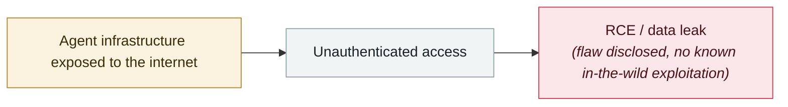

# ServiceNow BodySnatcher

     

## Summary

AppOmni discovered CVE-2025-12420, **CVSS 9.3**. The Virtual Agent API **issues the same hard-coded key** `servicenowexternalagent` to **every customer**; combined with trusted-email account linking it lets an attacker bypass MFA/SSO and impersonate any user. Fixes were pushed to most hosted instances on 10-30

## Attack chain

## Sources

| # | Source | Link |
|---|---|---|
| 1 | AppOmni | <https://appomni.com/ao-labs/bodysnatcher-agentic-ai-security-vulnerability-in-servicenow/> |
| 2 | CyberScoop | <https://cyberscoop.com/servicenow-fixes-critical-ai-vulnerability-cve-2025-12420/> |

## Metadata

| Field | Value |
|---|---|
| Date | `2025-10-30` (raw: 2025-10-30, precision `day`) |
| Kind | Vulnerability disclosure `vulnerability` |
| Type | [`INFRA`](../../taxonomy/types.md#infra) Agent infrastructure exposure |
| Severity | **High** `high` |
| Confidence | **A** — primary source (vendor / victim / law enforcement / official report) |
| Real harm | No |
| AI involvement | Confirmed `confirmed` |
| Region | [Global](../../regions/global.md) |
| Archive ID | `2025-10-30-servicenow-bodysnatcher` |

**Why this classification:** Vulnerability disclosure; as of archiving there is no evidence of in-the-wild exploitation, so `real_harm: false`. Rated `high`: real damage is limited in scope, or it is a CVSS 9+ severe flaw, or a capability demonstration of significance. Grading criteria: see [taxonomy/severity.md](../../taxonomy/severity.md) and [taxonomy/confidence.md](../../taxonomy/confidence.md).

## Related

**Topic:** [Agent infrastructure exposure](../../topics/agent-infra.md)

**Related records:**

- `2025-11-01` [ShadowRay 2.0 (Ray framework)](../2025-11/2025-11-01-shadowray-2-ray-framework.md)   ShadowRay 2.0 (Ray framework)
- `2026-01-26` [Clawdbot gateways exposed at scale](../2026-01/2026-01-26-clawdbot-wang-guan-gui-mo.md)   Clawdbot gateways exposed at scale
- `2026-01-29` [OpenClaw Control UI WebSocket hijack RCE](../2026-01/2026-01-29-openclaw-control-ui-websocket.md)   OpenClaw Control UI WebSocket hijack RCE
- `2026-02-28` [CodeWall breaches McKinsey's internal "Lilli" AI platform](../2026-02/2026-02-28-codewall-breaches-mckinsey-lilli.md)   CodeWall breaches McKinsey's internal "Lilli" AI platform

---

[← 2025-10 index](README.md) · [← All records](../../README.md) · [Chinese](../i18n/zh/2025-10/2025-10-30-servicenow-bodysnatcher.md)

This record is part of the **Orca AI Incident Archive**, licensed [CC BY 4.0](../../LICENSE). Found a factual error or a missing source? [Open an issue or PR](../../CONTRIBUTING.md) — corrections are recorded in the record's revision history, never silently overwritten.
