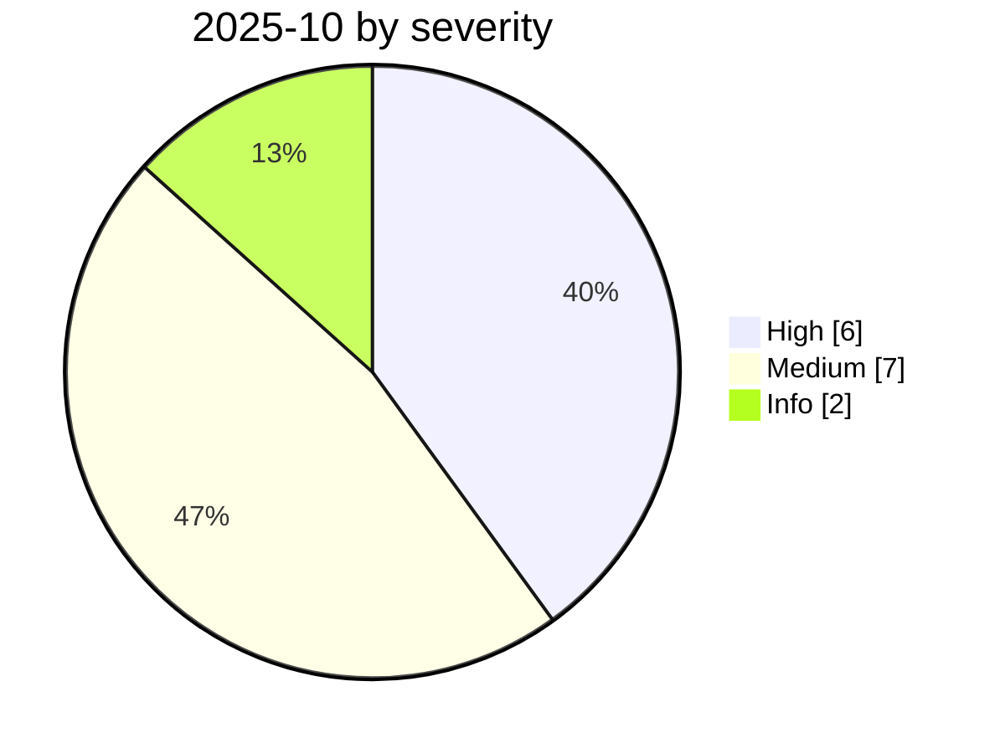

# 2025-10

<!-- BEGIN:summary -->
**15** records

   

## Records this month

| Date | Record | Type | Severity | Confidence | Real harm |
|---|---|---|---|---|---|
| `10-01` | [Claude Code recursively deletes from the filesystem root](2025-10-01-claude-code-gen-mu-lu.md) | `ROGUE` | **High** | B | ✅ |
| `10-01` | [Framelink Figma MCP RCE](2025-10-01-framelink-figma-mcp-rce.md) | `MCP` | Medium | A | — |
| `10-01` | [OpenAI Guardrails broken days after launch](2025-10-01-guardrails-kuang-jia-xian-shu.md) | `OTHER` | Medium | B | — |
| `10-02` | [CometJacking](2025-10-02-cometjacking.md) | `IPI` `EXFIL` | **High** | A | — |
| `10-07` | [OpenAI October threat report](2025-10-07-shi-wei-xie-bao-gao.md) | `WEAPON` `GOV` | Info | A | · |
| `10-08` | [CamoLeak (GitHub Copilot Chat)](2025-10-08-camoleak-github-copilot-chat.md) | `IPI` `EXFIL` | **High** | A | — |
| `10-21` | [Brave discloses screenshot-based injection in Comet](2025-10-21-brave-comet-pi-lu-jie.md) | `IPI` | Medium | A | — |
| `10-21` | [OpenAI launches the Atlas browser](2025-10-21-atlas-liu-lan-qi-fa.md) | `GOV` | Info | A | · |
| `10-22` | [Shadow Escape: first zero-click agent attack over MCP](2025-10-22-shadow-escape-mcp-agent.md) | `MCP` `EXFIL` | **High** | A | — |
| `10-24` | [Atlas omnibox jailbreak](2025-10-24-atlas-omnibox-yue-yu.md) | `IPI` | Medium | A | — |
| `10-27` | [Atlas "poisoned memory"](2025-10-27-atlas-wu-ran-ji-yi.md) | `IPI` | Medium | B | — |
| `10-28` | [Claude Code API key exfiltration](2025-10-28-claude-code-api.md) | `CRED` | **High** | A | ✅ |
| `10-30` | [ServiceNow BodySnatcher](2025-10-30-servicenow-bodysnatcher.md) | `INFRA` | **High** | A | — |
| `10-30` | [Anthropic confirms a prompt-injection flaw in Claude](2025-10-30-anthropic-claude-que-ren-cun.md) | `IPI` | Medium | A | — |
| `10-31` | [Agent Session Smuggling: agents deceiving agents over A2A](2025-10-31-agent-session-smuggling-a2a.md) | `IPI` | Medium | A | — |

★ = `critical` · ⚠️ = disputed facts or attribution · real harm: ✅ confirmed victim / — none / · not applicable (policy and intelligence reports)
<!-- END:summary -->

<!-- BEGIN:nav -->
---

[← 2025-09](../2025-09/README.md) · [Archive index](../../README.md) · [By type](../../taxonomy/types.md) · [2025-11 →](../2025-11/README.md)
<!-- END:nav -->
