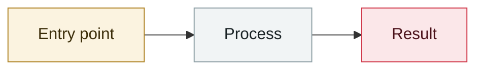

# OpenClaw (then Clawdbot) released

     

## Summary

Peter Steinberger open-sources a personal AI agent; two months later it sets off the biggest security crisis of 2026

## Attack chain

## Sources

| # | Source | Link |
|---|---|---|
| 1 | Wikipedia | <https://en.wikipedia.org/wiki/OpenClaw> |

## Metadata

| Field | Value |
|---|---|
| Date | `2025-11-01` (raw: 2025-11, precision `month`) |
| Kind | Incident `incident` |
| Type | [`OTHER`](../../taxonomy/types.md#other) Other |
| Severity | **Low** `low` |
| Confidence | **A** — primary source (vendor / victim / law enforcement / official report) |
| Real harm | No |
| AI involvement | Confirmed `confirmed` |
| Region | [Global](../../regions/global.md) |
| Archive ID | `2025-11-01-openclaw-clawdbot-shi-ming-fa` |

**Why this classification:** Real incident without a confirmed specific victim. Rated `low`: context entry, kept for timeline continuity. Grading criteria: see [taxonomy/severity.md](../../taxonomy/severity.md) and [taxonomy/confidence.md](../../taxonomy/confidence.md).

---

[← 2025-11 index](README.md) · [← All records](../../README.md) · [Chinese](../i18n/zh/2025-11/2025-11-01-openclaw-clawdbot-shi-ming-fa.md)

This record is part of the **Orca AI Incident Archive**, licensed [CC BY 4.0](../../LICENSE). Found a factual error or a missing source? [Open an issue or PR](../../CONTRIBUTING.md) — corrections are recorded in the record's revision history, never silently overwritten.
