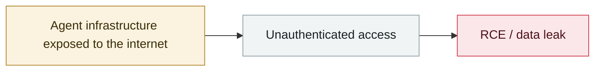

# ShadowRay 2.0 (Ray framework)

     

> [!WARNING]
> **This record contains disputed or not fully confirmed facts**; the claims of each party are kept side by side in the body, so do not cite any single one of them in isolation.

## Summary

Oligo Security: exploits **CVE-2023-48022** (left unfixed because Ray's maintainers consider it "consistent with the designed trust model") to build a self-propagating botnet that compromised **230,000+** internet-facing Ray servers (many with NVIDIA A100s), used for cryptomining, data and credential theft, and DDoS. **Much of the attack payload is AI-generated** — marked by redundant docstrings, pointless echo statements, repeated comments and boilerplate error handling

## Attack chain

## Sources

| # | Source | Link |
|---|---|---|
| 1 | Oligo | <https://www.oligo.security/blog/shadowray-attack-ai-workloads-actively-exploited-in-the-wild> |

## Metadata

| Field | Value |
|---|---|
| Date | `2025-11-01` (raw: 2025-11, precision `month`) |
| Kind | Incident `incident` |
| Type | [`INFRA`](../../taxonomy/types.md#infra) Agent infrastructure exposure |
| Severity | **Critical** `critical` |
| Confidence | **B** — research lab or major outlet with checkable detail |
| Real harm | Yes |
| AI involvement | Confirmed `confirmed` |
| Region | [Global](../../regions/global.md) |
| Archive ID | `2025-11-01-shadowray-2-ray-framework` |

**Why this classification:** Real incident with a confirmed victim. Rated `critical`: confirmed real damage at the multi-organization / government / critical-infrastructure / supply-chain-worm level, or a first-of-its-kind capability milestone with real victims. Grading criteria: see [taxonomy/severity.md](../../taxonomy/severity.md) and [taxonomy/confidence.md](../../taxonomy/confidence.md).

## Related

**Topic:** [Agent infrastructure exposure](../../topics/agent-infra.md)

**Related records:**

- `2025-10-30` [ServiceNow BodySnatcher](../2025-10/2025-10-30-servicenow-bodysnatcher.md)   ServiceNow BodySnatcher
- `2026-01-26` [Clawdbot gateways exposed at scale](../2026-01/2026-01-26-clawdbot-wang-guan-gui-mo.md)   Clawdbot gateways exposed at scale
- `2026-01-29` [OpenClaw Control UI WebSocket hijack RCE](../2026-01/2026-01-29-openclaw-control-ui-websocket.md)   OpenClaw Control UI WebSocket hijack RCE
- `2026-02-28` [CodeWall breaches McKinsey's internal "Lilli" AI platform](../2026-02/2026-02-28-codewall-breaches-mckinsey-lilli.md)   CodeWall breaches McKinsey's internal "Lilli" AI platform

---

[← 2025-11 index](README.md) · [← All records](../../README.md) · [Chinese](../i18n/zh/2025-11/2025-11-01-shadowray-2-ray-framework.md)

This record is part of the **Orca AI Incident Archive**, licensed [CC BY 4.0](../../LICENSE). Found a factual error or a missing source? [Open an issue or PR](../../CONTRIBUTING.md) — corrections are recorded in the record's revision history, never silently overwritten.
