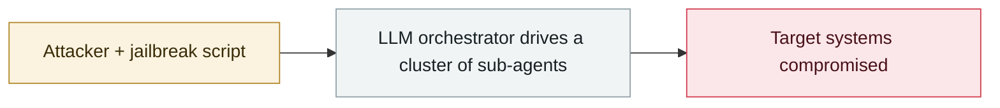

# SesameOp

     

## Summary

Found by Microsoft DART during an incident response in **2025-07**, published 11-03. The backdoor uses the **OpenAI Assistants API as a C2 channel**, with instructions hidden in an encrypted assistant description. Microsoft stresses that **this is not a vulnerability or misconfiguration but abuse of built-in capabilities**; after a joint investigation with OpenAI, the related API key and accounts were banned. (The Assistants API will be retired in 2026-08)

## Attack chain

## Sources

| # | Source | Link |
|---|---|---|
| 1 | Microsoft | <https://www.microsoft.com/en-us/security/blog/2025/11/03/sesameop-novel-backdoor-uses-openai-assistants-api-for-command-and-control/> |
| 2 | The Register | <https://www.theregister.com/2025/11/04/openai_api_moonlights_as_malware/> |

## Metadata

| Field | Value |
|---|---|
| Date | `2025-11-03` (raw: 2025-11-03, precision `day`) |
| Kind | Incident `incident` |
| Type | [`WEAPON`](../../taxonomy/types.md#weapon) Agent used as a weapon |
| Severity | **High** `high` |
| Confidence | **A** — primary source (vendor / victim / law enforcement / official report) |
| Real harm | Yes |
| AI involvement | Confirmed `confirmed` |
| Region | [Global](../../regions/global.md) |
| Archive ID | `2025-11-03-sesameop` |

**Why this classification:** Real incident with a confirmed victim. Rated `high`: real damage is limited in scope, or it is a CVSS 9+ severe flaw, or a capability demonstration of significance. Grading criteria: see [taxonomy/severity.md](../../taxonomy/severity.md) and [taxonomy/confidence.md](../../taxonomy/confidence.md).

## Related

**Topic:** [Offensive AI capability evolution](../../topics/offensive-ai.md)

**Related records:**

- `2025-11-13` [GTG-1002: first AI-orchestrated cyber-espionage campaign](2025-11-13-gtg-1002-first-ai-orchestrated-espionage.md)   GTG-1002: first AI-orchestrated cyber-espionage campaign
- `2025-11-05` [GTIG: PROMPTFLUX / PROMPTSTEAL](2025-11-05-gtig-promptflux-promptsteal.md)   GTIG: PROMPTFLUX / PROMPTSTEAL
- `2025-12-28` [Mexico government intrusion campaign begins](../2025-12/2025-12-28-mexico-government-intrusion-begins.md)   Mexico government intrusion campaign begins
- `2025-10-07` [OpenAI October threat report](../2025-10/2025-10-07-shi-wei-xie-bao-gao.md)   OpenAI October threat report

---

[← 2025-11 index](README.md) · [← All records](../../README.md) · [Chinese](../i18n/zh/2025-11/2025-11-03-sesameop.md)

This record is part of the **Orca AI Incident Archive**, licensed [CC BY 4.0](../../LICENSE). Found a factual error or a missing source? [Open an issue or PR](../../CONTRIBUTING.md) — corrections are recorded in the record's revision history, never silently overwritten.
