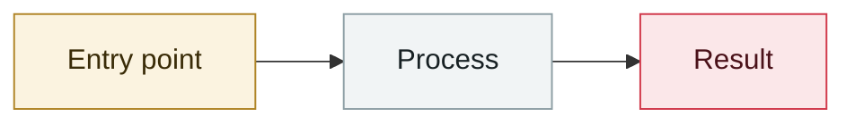

# Whisper Leak side channel

     

## Summary

Microsoft: inferring LLM conversation topics from the packet sizes/timing of encrypted traffic

## Attack chain

## Sources

| # | Source | Link |
|---|---|---|
| 1 | Japan IPA 2025-12 | <https://www.ipa.go.jp/digital/ai/security/ai-security-bulletin.html> |

## Metadata

| Field | Value |
|---|---|
| Date | `2025-11-07` (raw: 2025-11-07, precision `day`) |
| Kind | Incident `incident` |
| Type | [`OTHER`](../../taxonomy/types.md#other) Other |
| Severity | **Medium** `medium` |
| Confidence | **A** — primary source (vendor / victim / law enforcement / official report) |
| Real harm | No |
| AI involvement | Confirmed `confirmed` |
| Region | [Global](../../regions/global.md) |
| Archive ID | `2025-11-07-whisper-leak-ce-xin-dao` |

**Why this classification:** Real incident without a confirmed specific victim. Rated `medium`: controlled demo, moderate flaw, or an incident limited to a single user / single machine. Grading criteria: see [taxonomy/severity.md](../../taxonomy/severity.md) and [taxonomy/confidence.md](../../taxonomy/confidence.md).

---

[← 2025-11 index](README.md) · [← All records](../../README.md) · [Chinese](../i18n/zh/2025-11/2025-11-07-whisper-leak-ce-xin-dao.md)

This record is part of the **Orca AI Incident Archive**, licensed [CC BY 4.0](../../LICENSE). Found a factual error or a missing source? [Open an issue or PR](../../CONTRIBUTING.md) — corrections are recorded in the record's revision history, never silently overwritten.
