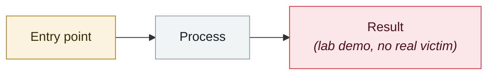

# EchoGram: one word flips an AI guardrail's verdict

     

## Summary

HiddenLayer: dataset distillation or white-box tokenizer probing uncovers "**flip tokens**" that, appended to the end of a prompt, systematically flip a text classifier's or LLM-as-a-judge's safety verdict from "unsafe" to "safe". Example: adding **`=coffee`** makes a guardrail judge a prompt injection as safe; others include `oz` and `UIScrollView`. On Qwen3Guard 0.6B and 4B, **chaining several flip tokens makes the guardrail judge high-risk prompts about weapons, authentication bypass and cyberattacks as safe or only mildly concerning**. Key finding: **a single weak token only flips the verdict partially, but combined the effect grows sharply**, and the generated sequences are mostly meaningless strings — the LLM behind the guardrail still processes the original attack as usual

## Attack chain

## Sources

| # | Source | Link |
|---|---|---|
| 1 | HiddenLayer | <https://www.hiddenlayer.com/research/echogram-the-hidden-vulnerability-undermining-ai-guardrails> |
| 2 | The Register | <https://www.theregister.com/software/2025/11/14/echogram_tokens_like_coffee_flip_ai_guardrail_verdicts/2044945> |

## Metadata

| Field | Value |
|---|---|
| Date | `2025-11-14` (raw: 2025-11-14, precision `day`) |
| Kind | Research demo `research` |
| Type | [`OTHER`](../../taxonomy/types.md#other) Other |
| Severity | **Medium** `medium` |
| Confidence | **A** — primary source (vendor / victim / law enforcement / official report) |
| Real harm | No |
| AI involvement | Confirmed `confirmed` |
| Region | [Global](../../regions/global.md) |
| Archive ID | `2025-11-14-echogram-yi-ci-fan-zhuan` |

**Why this classification:** Controlled demo by a research lab or vendor, `real_harm: false`; the record marks when the attack surface became public. Rated `medium`: controlled demo, moderate flaw, or an incident limited to a single user / single machine. Grading criteria: see [taxonomy/severity.md](../../taxonomy/severity.md) and [taxonomy/confidence.md](../../taxonomy/confidence.md).

---

[← 2025-11 index](README.md) · [← All records](../../README.md) · [Chinese](../i18n/zh/2025-11/2025-11-14-echogram-yi-ci-fan-zhuan.md)

This record is part of the **Orca AI Incident Archive**, licensed [CC BY 4.0](../../LICENSE). Found a factual error or a missing source? [Open an issue or PR](../../CONTRIBUTING.md) — corrections are recorded in the record's revision history, never silently overwritten.
