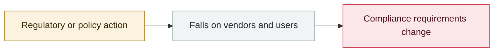

# EU "Digital Omnibus" proposes delaying the AI Act

     

## Summary

A European Commission proposal delays the high-risk obligations from the original **2026-08-02**: Annex III standalone AI systems move to **2027-12-02** and Annex I embedded systems to **2028-08-02**. The reason given is severe delays in member states designating competent authorities and in developing harmonised standards. A provisional political agreement was reached on 2026-05-06 and confirmed by the Council on 05-13

## Attack chain

## Sources

| # | Source | Link |
|---|---|---|
| 1 | DLA Piper | <https://knowledge.dlapiper.com/dlapiperknowledge/globalemploymentlatestdevelopments/2026/The-Digital-AI-Omnibus-Proposed-deferral-of-high-risk-AI-obligations-under-the-AI-Act> |
| 2 | Gibson Dunn | <https://www.gibsondunn.com/eu-ai-act-omnibus-agreement-postponed-high-risk-deadlines-and-other-key-changes/> |

## Metadata

| Field | Value |
|---|---|
| Date | `2025-11-19` (raw: 2025-11-19, precision `day`) |
| Kind | Policy & regulation `policy` |
| Type | [`GOV`](../../taxonomy/types.md#gov) Governance & policy |
| Severity | **Info** `info` |
| Confidence | **A** — primary source (vendor / victim / law enforcement / official report) |
| Real harm | n/a |
| AI involvement | Confirmed `confirmed` |
| Region | [Europe](../../regions/eu.md) |
| Archive ID | `2025-11-19-digital-omnibus-act` |

**Why this classification:** Policy / regulatory action, not counted in incident statistics; `severity` is recorded as `info`. Grading criteria: see [taxonomy/severity.md](../../taxonomy/severity.md) and [taxonomy/confidence.md](../../taxonomy/confidence.md).

## Related

**Topic:** [Defense & governance](../../topics/defense.md)

**Related records:**

- `2025-10-07` [OpenAI October threat report](../2025-10/2025-10-07-shi-wei-xie-bao-gao.md)   OpenAI October threat report
- `2025-10-21` [OpenAI launches the Atlas browser](../2025-10/2025-10-21-atlas-liu-lan-qi-fa.md)   OpenAI launches the Atlas browser
- `2025-12-09` [OWASP Top 10 for Agentic Applications 2026](../2025-12/2025-12-09-owasp-top-agentic-applications.md)   OWASP Top 10 for Agentic Applications 2026
- `2025-12-11` [GPT-5.2 system card updates cyber capability](../2025-12/2025-12-11-gpt-xi-tong-ka-wang.md)   GPT-5.2 system card updates cyber capability

---

[← 2025-11 index](README.md) · [← All records](../../README.md) · [Chinese](../i18n/zh/2025-11/2025-11-19-digital-omnibus-act.md)

This record is part of the **Orca AI Incident Archive**, licensed [CC BY 4.0](../../LICENSE). Found a factual error or a missing source? [Open an issue or PR](../../CONTRIBUTING.md) — corrections are recorded in the record's revision history, never silently overwritten.
