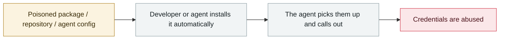

# Shai-Hulud 2.0

      

## Summary

The second wave of the self-replicating worm: **796 unique npm packages** backdoored, **25,000+ repositories / about 350 users** affected (Zapier, ENS Domains, PostHog, Postman and others). It now runs at the **preinstall stage** (before dependency resolution), hitting build systems nearly 100% of the time with no user interaction required

## Attack chain

## Sources

| # | Source | Link |
|---|---|---|
| 1 | Wiz | <https://www.wiz.io/blog/shai-hulud-2-0-ongoing-supply-chain-attack> |
| 2 | Unit 42 | <https://unit42.paloaltonetworks.com/npm-supply-chain-attack/> |
| 3 | Datadog | <https://securitylabs.datadoghq.com/articles/shai-hulud-2.0-npm-worm/> |

## Metadata

| Field | Value |
|---|---|
| Date | `2025-11-21` → `2025-11-24` (raw: 2025-11-21→24, precision `day`) |
| Kind | Incident `incident` |
| Type | [`SUPPLY`](../../taxonomy/types.md#supply) Supply-chain poisoning · [`CRED`](../../taxonomy/types.md#cred) Credential abuse |
| Severity | **Critical** `critical` |
| Confidence | **A** — primary source (vendor / victim / law enforcement / official report) |
| Real harm | Yes |
| AI involvement | Confirmed `confirmed` |
| Region | [Global](../../regions/global.md) |
| Archive ID | `2025-11-21-shai-hulud` |

**Why this classification:** Real incident with a confirmed victim. Rated `critical`: confirmed real damage at the multi-organization / government / critical-infrastructure / supply-chain-worm level, or a first-of-its-kind capability milestone with real victims. Grading criteria: see [taxonomy/severity.md](../../taxonomy/severity.md) and [taxonomy/confidence.md](../../taxonomy/confidence.md).

## Related

**Topic:** [Agent supply-chain poisoning](../../topics/agent-supply-chain.md)

**Related records:**

- `2025-11-25` [OpenAI reports the third-party Mixpanel breach](2025-11-25-mixpanel-tong-bao-di-san.md)   OpenAI reports the third-party Mixpanel breach
- `2025-10-28` [Claude Code API key exfiltration](../2025-10/2025-10-28-claude-code-api.md)   Claude Code API key exfiltration
- `2025-12-15` ["Privacy" browser extensions resell AI conversations](../2025-12/2025-12-15-yin-si-liu-lan-qi.md)   "Privacy" browser extensions resell AI conversations
- `2025-12-30` [Chrome extensions steal ChatGPT and DeepSeek conversations](../2025-12/2025-12-30-chrome-chatgpt-deepseek.md)   Chrome extensions steal ChatGPT and DeepSeek conversations

---

[← 2025-11 index](README.md) · [← All records](../../README.md) · [Chinese](../i18n/zh/2025-11/2025-11-21-shai-hulud.md)

This record is part of the **Orca AI Incident Archive**, licensed [CC BY 4.0](../../LICENSE). Found a factual error or a missing source? [Open an issue or PR](../../CONTRIBUTING.md) — corrections are recorded in the record's revision history, never silently overwritten.
