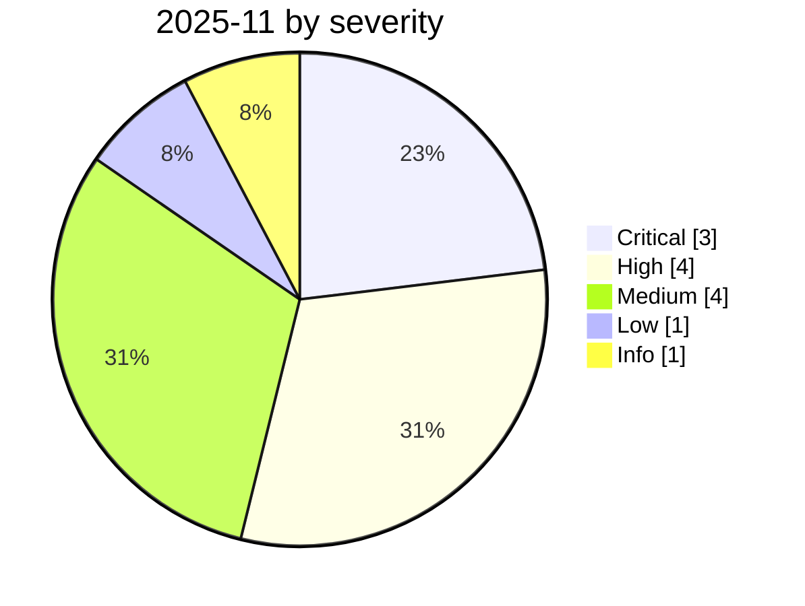

# 2025-11

<!-- BEGIN:summary -->
**13** records

     

## Records this month

| Date | Record | Type | Severity | Confidence | Real harm |
|---|---|---|---|---|---|
| `11-01` | ★ [ShadowRay 2.0 (Ray framework)](2025-11-01-shadowray-2-ray-framework.md) ⚠️ | `INFRA` | **Critical** | B | ✅ |
| `11-01` | [Google Antigravity deletes an entire D: partition](2025-11-01-google-antigravity-shan-chu-zheng.md) | `ROGUE` | **High** | B | ✅ |
| `11-01` | [Gemini CLI destructive file move](2025-11-01-gemini-cli-po-huai-xing.md) | `ROGUE` | Medium | B | ✅ |
| `11-01` | [OpenClaw (then Clawdbot) released](2025-11-01-openclaw-clawdbot-shi-ming-fa.md) | `OTHER` | Low | A | — |
| `11-03` | [SesameOp](2025-11-03-sesameop.md) | `WEAPON` | **High** | A | ✅ |
| `11-05` | [GTIG: PROMPTFLUX / PROMPTSTEAL](2025-11-05-gtig-promptflux-promptsteal.md) | `WEAPON` | **High** | A | ✅ |
| `11-07` | [Whisper Leak side channel](2025-11-07-whisper-leak-ce-xin-dao.md) | `OTHER` | Medium | A | — |
| `11-13` | ★ [GTG-1002: first AI-orchestrated cyber-espionage campaign](2025-11-13-gtg-1002-first-ai-orchestrated-espionage.md) | `WEAPON` | **Critical** | A | ✅ |
| `11-14` | [EchoGram: one word flips an AI guardrail's verdict](2025-11-14-echogram-yi-ci-fan-zhuan.md) | `OTHER` | Medium | A | — |
| `11-19` | [EU "Digital Omnibus" proposes delaying the AI Act](2025-11-19-digital-omnibus-act.md) | `GOV` | Info | A | · |
| `11-20` | [ServiceNow Now Assist second-order prompt injection](2025-11-20-servicenow-now-assist.md) | `IPI` | Medium | A | — |
| `11-21` | ★ [Shai-Hulud 2.0](2025-11-21-shai-hulud.md) | `SUPPLY` `CRED` | **Critical** | A | ✅ |
| `11-25` | [OpenAI reports the third-party Mixpanel breach](2025-11-25-mixpanel-tong-bao-di-san.md) | `CRED` | **High** | A | ✅ |

★ = `critical` · ⚠️ = disputed facts or attribution · real harm: ✅ confirmed victim / — none / · not applicable (policy and intelligence reports)
<!-- END:summary -->

<!-- BEGIN:nav -->
---

[← 2025-10](../2025-10/README.md) · [Archive index](../../README.md) · [By type](../../taxonomy/types.md) · [2025-12 →](../2025-12/README.md)
<!-- END:nav -->
