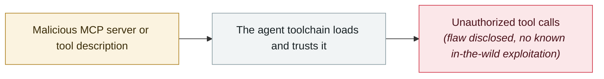

# Three CVEs in Anthropic's Git MCP Server

     

> [!WARNING]
> **This record contains disputed or not fully confirmed facts**; the claims of each party are kept side by side in the body, so do not cite any single one of them in isolation.

## Summary

Anthropic **accepted the report in 2025-09, shipped fixes in 2025-12, went public in 2026-01**. CVE-2025-68143: `git_init` accepts an arbitrary filesystem path without validation, turning any directory into a git repository; CVE-2025-68145: the `--repository` restriction is not validated on subsequent calls, allowing access to any repository on the system; CVE-2025-68144: `git_diff` / `git_checkout` pass user-controllable arguments straight to GitPython. Combined with a filesystem MCP server, this allows executing code, deleting arbitrary files and stuffing arbitrary files into the LLM context

## Attack chain

## Sources

| # | Source | Link |
|---|---|---|
| 1 | The Register | <https://www.theregister.com/security/2026/01/20/anthropic-quietly-fixed-flaws-in-its-git-mcp-server/4676059> |
| 2 | THN | <https://thehackernews.com/2026/01/three-flaws-in-anthropic-mcp-git-server.html> |

## Metadata

| Field | Value |
|---|---|
| Date | `2025-12-01` (raw: fixed 2025-12 / disclosed 2026-01, precision `month`) |
| Kind | Vulnerability disclosure `vulnerability` |
| Type | [`MCP`](../../taxonomy/types.md#mcp) MCP & tool-chain |
| Severity | **Medium** `medium` |
| Confidence | **A** — primary source (vendor / victim / law enforcement / official report) |
| Real harm | No |
| AI involvement | Confirmed `confirmed` |
| Region | [Global](../../regions/global.md) |
| Archive ID | `2025-12-01-anthropic-git-mcp-server` |

**Why this classification:** Vulnerability disclosure; as of archiving there is no evidence of in-the-wild exploitation, so `real_harm: false`. Rated `medium`: controlled demo, moderate flaw, or an incident limited to a single user / single machine. Grading criteria: see [taxonomy/severity.md](../../taxonomy/severity.md) and [taxonomy/confidence.md](../../taxonomy/confidence.md).

## Related

**Topic:** [Agent supply-chain poisoning](../../topics/agent-supply-chain.md)

**Related records:**

- `2025-12-06` [IDEsaster](2025-12-06-idesaster.md)   IDEsaster
- `2025-12-01` [MCP TypeScript SDK DNS rebinding](2025-12-01-mcp-typescript-sdk-dns.md)   MCP TypeScript SDK DNS rebinding
- `2025-10-22` [Shadow Escape: first zero-click agent attack over MCP](../2025-10/2025-10-22-shadow-escape-mcp-agent.md)   Shadow Escape: first zero-click agent attack over MCP
- `2025-10-01` [Framelink Figma MCP RCE](../2025-10/2025-10-01-framelink-figma-mcp-rce.md)   Framelink Figma MCP RCE

---

[← 2025-12 index](README.md) · [← All records](../../README.md) · [Chinese](../i18n/zh/2025-12/2025-12-01-anthropic-git-mcp-server.md)

This record is part of the **Orca AI Incident Archive**, licensed [CC BY 4.0](../../LICENSE). Found a factual error or a missing source? [Open an issue or PR](../../CONTRIBUTING.md) — corrections are recorded in the record's revision history, never silently overwritten.
