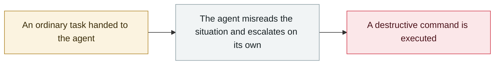

# Claude Code deletes a Mac home directory, Keychain included

     

## Summary

`rm -rf tests/ patches/ plan/ ~/`; TRIM had already zeroed the data, so recovery was impossible

## Attack chain

## Sources

| # | Source | Link |
|---|---|---|
| 1 | Adversa roundup | <https://adversa.ai/blog/ai-coding-agent-incidents/> |

## Metadata

| Field | Value |
|---|---|
| Date | `2025-12-01` (raw: 2025-12, precision `month`) |
| Kind | Incident `incident` |
| Type | [`ROGUE`](../../taxonomy/types.md#rogue) Rogue agent action |
| Severity | **High** `high` |
| Confidence | **B** — research lab or major outlet with checkable detail |
| Real harm | Yes |
| AI involvement | Confirmed `confirmed` |
| Region | [Global](../../regions/global.md) |
| Archive ID | `2025-12-01-claude-code-mac-keychain` |

**Why this classification:** Real incident with a confirmed victim. Rated `high`: real damage is limited in scope, or it is a CVSS 9+ severe flaw, or a capability demonstration of significance. Grading criteria: see [taxonomy/severity.md](../../taxonomy/severity.md) and [taxonomy/confidence.md](../../taxonomy/confidence.md).

## Related

**Topic:** [Coding agent autonomous sabotage](../../topics/rogue-agents.md)

**Related records:**

- `2025-12-15` [Amazon Kiro triggers a 13-hour AWS outage](2025-12-15-amazon-kiro-aws.md)   Amazon Kiro triggers a 13-hour AWS outage
- `2025-12-01` [Cursor Plan Mode ignores "DO NOT RUN ANYTHING", deletes ~70 files](2025-12-01-cursor-plan-mode.md)   Cursor Plan Mode ignores "DO NOT RUN ANYTHING", deletes ~70 files
- `2025-12-01` [LLM-driven humanoid robot jailbroken into firing a weapon](2025-12-01-llm-qu-dong-ren-xing.md)   LLM-driven humanoid robot jailbroken into firing a weapon
- `2025-11-01` [Google Antigravity deletes an entire D: partition](../2025-11/2025-11-01-google-antigravity-shan-chu-zheng.md)   Google Antigravity deletes an entire D: partition

---

[← 2025-12 index](README.md) · [← All records](../../README.md) · [Chinese](../i18n/zh/2025-12/2025-12-01-claude-code-mac-keychain.md)

This record is part of the **Orca AI Incident Archive**, licensed [CC BY 4.0](../../LICENSE). Found a factual error or a missing source? [Open an issue or PR](../../CONTRIBUTING.md) — corrections are recorded in the record's revision history, never silently overwritten.
