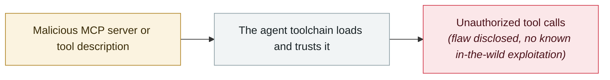

# MCP TypeScript SDK DNS rebinding

     

## Summary

CVE-2025-66414, **CVSS 8.1**. An unauthenticated HTTP MCP server running on localhost without `enableDnsRebindingProtection` can be made to invoke tools by a malicious website via DNS rebinding that bypasses the same-origin policy. **Fixed in v1.24.0**: `createMcpExpressApp()` now enables protection by default when binding to localhost

## Attack chain

## Sources

| # | Source | Link |
|---|---|---|
| 1 | GHSA-w48q-cv73-mx4w | <https://github.com/modelcontextprotocol/typescript-sdk/security/advisories/GHSA-w48q-cv73-mx4w> |

## Metadata

| Field | Value |
|---|---|
| Date | `2025-12-01` (raw: 2025-12, precision `month`) |
| Kind | Vulnerability disclosure `vulnerability` |
| Type | [`MCP`](../../taxonomy/types.md#mcp) MCP & tool-chain |
| Severity | **Medium** `medium` |
| Confidence | **A** — primary source (vendor / victim / law enforcement / official report) |
| Real harm | No |
| AI involvement | Confirmed `confirmed` |
| Region | [Global](../../regions/global.md) |
| Archive ID | `2025-12-01-mcp-typescript-sdk-dns` |

**Why this classification:** Vulnerability disclosure; as of archiving there is no evidence of in-the-wild exploitation, so `real_harm: false`. Rated `medium`: controlled demo, moderate flaw, or an incident limited to a single user / single machine. Grading criteria: see [taxonomy/severity.md](../../taxonomy/severity.md) and [taxonomy/confidence.md](../../taxonomy/confidence.md).

## Related

**Topic:** [Agent supply-chain poisoning](../../topics/agent-supply-chain.md)

**Related records:**

- `2025-12-06` [IDEsaster](2025-12-06-idesaster.md)   IDEsaster
- `2025-12-01` [Three CVEs in Anthropic's Git MCP Server](2025-12-01-anthropic-git-mcp-server.md)   Three CVEs in Anthropic's Git MCP Server
- `2025-10-22` [Shadow Escape: first zero-click agent attack over MCP](../2025-10/2025-10-22-shadow-escape-mcp-agent.md)   Shadow Escape: first zero-click agent attack over MCP
- `2025-10-01` [Framelink Figma MCP RCE](../2025-10/2025-10-01-framelink-figma-mcp-rce.md)   Framelink Figma MCP RCE

---

[← 2025-12 index](README.md) · [← All records](../../README.md) · [Chinese](../i18n/zh/2025-12/2025-12-01-mcp-typescript-sdk-dns.md)

This record is part of the **Orca AI Incident Archive**, licensed [CC BY 4.0](../../LICENSE). Found a factual error or a missing source? [Open an issue or PR](../../CONTRIBUTING.md) — corrections are recorded in the record's revision history, never silently overwritten.
