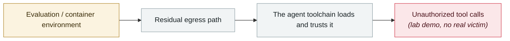

# IDEsaster

      

## Summary

Researcher **Ari Marzouk (MaccariTA)**, a six-month investigation, 30+ vulnerabilities: **100% of the AI IDEs and coding assistants tested were affected**, at least **24 CVEs** plus an additional AWS advisory. Covers GitHub Copilot, Cursor, Windsurf, Kiro.dev, Zed.dev, Roo Code, Junie, Cline, Gemini CLI and Claude Code. The common pattern: place payloads in files the AI reads (repository config, code comments, issue descriptions, MCP tool responses) and direct the AI to **weaponize the IDE's legitimate features**

## Attack chain

## Sources

| # | Source | Link |
|---|---|---|
| 1 | THN | <https://thehackernews.com/2025/12/researchers-uncover-30-flaws-in-ai.html> |
| 2 | Tom's Hardware | <https://www.tomshardware.com/tech-industry/cyber-security/researchers-uncover-critical-ai-ide-flaws-exposing-developers-to-data-theft-and-rce> |

## Metadata

| Field | Value |
|---|---|
| Date | `2025-12-06` (raw: 2025-12-06, precision `day`) |
| Kind | Research demo `research` |
| Type | [`SANDBOX`](../../taxonomy/types.md#sandbox) Sandbox escape · [`MCP`](../../taxonomy/types.md#mcp) MCP & tool-chain |
| Severity | **Medium** `medium` |
| Confidence | **A** — primary source (vendor / victim / law enforcement / official report) |
| Real harm | No |
| AI involvement | Confirmed `confirmed` |
| Region | [Global](../../regions/global.md) |
| Archive ID | `2025-12-06-idesaster` |

**Why this classification:** Controlled demo by a research lab or vendor, `real_harm: false`; the record marks when the attack surface became public. Rated `medium`: controlled demo, moderate flaw, or an incident limited to a single user / single machine. Grading criteria: see [taxonomy/severity.md](../../taxonomy/severity.md) and [taxonomy/confidence.md](../../taxonomy/confidence.md).

## Related

**Topic:** [Frontier model autonomous overreach](../../topics/eval-escapes.md) · [Agent supply-chain poisoning](../../topics/agent-supply-chain.md)

**Related records:**

- `2025-12-01` [MCP TypeScript SDK DNS rebinding](2025-12-01-mcp-typescript-sdk-dns.md)   MCP TypeScript SDK DNS rebinding
- `2025-12-01` [Three CVEs in Anthropic's Git MCP Server](2025-12-01-anthropic-git-mcp-server.md)   Three CVEs in Anthropic's Git MCP Server
- `2026-01-14` [Cursor allowlist bypass CVE-2026-22708](../2026-01/2026-01-14-cursor-bai-ming-dan-rao.md)   Cursor allowlist bypass CVE-2026-22708
- `2025-10-22` [Shadow Escape: first zero-click agent attack over MCP](../2025-10/2025-10-22-shadow-escape-mcp-agent.md)   Shadow Escape: first zero-click agent attack over MCP

---

[← 2025-12 index](README.md) · [← All records](../../README.md) · [Chinese](../i18n/zh/2025-12/2025-12-06-idesaster.md)

This record is part of the **Orca AI Incident Archive**, licensed [CC BY 4.0](../../LICENSE). Found a factual error or a missing source? [Open an issue or PR](../../CONTRIBUTING.md) — corrections are recorded in the record's revision history, never silently overwritten.
