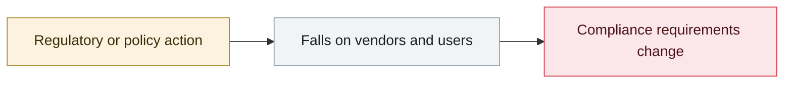

# OWASP Top 10 for Agentic Applications 2026

     

## Summary

Peer-reviewed by 100+ experts, the first Top 10 specifically for autonomous agents. Includes **ASI01 Agent Goal Hijack**, **ASI04 Agentic Supply Chain**, **ASI05 Unexpected Code Execution** and **ASI10 Rogue Agents**

## Attack chain

## Sources

| # | Source | Link |
|---|---|---|
| 1 | OWASP | <https://genai.owasp.org/resource/owasp-top-10-for-agentic-applications-for-2026/> |

## Metadata

| Field | Value |
|---|---|
| Date | `2025-12-09` (raw: 2025-12-09, precision `day`) |
| Kind | Policy & regulation `policy` |
| Type | [`GOV`](../../taxonomy/types.md#gov) Governance & policy |
| Severity | **Info** `info` |
| Confidence | **A** — primary source (vendor / victim / law enforcement / official report) |
| Real harm | n/a |
| AI involvement | Confirmed `confirmed` |
| Region | [Global](../../regions/global.md) |
| Archive ID | `2025-12-09-owasp-top-agentic-applications` |

**Why this classification:** Policy / regulatory action, not counted in incident statistics; `severity` is recorded as `info`. Grading criteria: see [taxonomy/severity.md](../../taxonomy/severity.md) and [taxonomy/confidence.md](../../taxonomy/confidence.md).

## Related

**Topic:** [Defense & governance](../../topics/defense.md)

**Related records:**

- `2025-12-11` [GPT-5.2 system card updates cyber capability](2025-12-11-gpt-xi-tong-ka-wang.md)   GPT-5.2 system card updates cyber capability
- `2025-12-22` [OpenAI: browser prompt injection "may never be fully solved"](2025-12-22-liu-lan-qi-ti-shi.md)   OpenAI: browser prompt injection "may never be fully solved"
- `2025-11-19` [EU "Digital Omnibus" proposes delaying the AI Act](../2025-11/2025-11-19-digital-omnibus-act.md)   EU "Digital Omnibus" proposes delaying the AI Act
- `2026-01-30` [Anthropic ships Constitutional Classifiers++](../2026-01/2026-01-30-anthropic-constitutional-classifiers.md)   Anthropic ships Constitutional Classifiers++

---

[← 2025-12 index](README.md) · [← All records](../../README.md) · [Chinese](../i18n/zh/2025-12/2025-12-09-owasp-top-agentic-applications.md)

This record is part of the **Orca AI Incident Archive**, licensed [CC BY 4.0](../../LICENSE). Found a factual error or a missing source? [Open an issue or PR](../../CONTRIBUTING.md) — corrections are recorded in the record's revision history, never silently overwritten.
