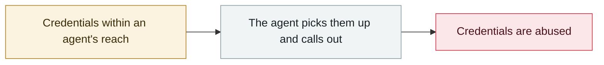

# "Privacy" browser extensions resell AI conversations

     

## Summary

Koi Security: Urban VPN and others, about 8 million users

## Attack chain

## Sources

| # | Source | Link |
|---|---|---|
| 1 | Koi | <https://www.koi.ai/blog/urban-vpn-browser-extension-ai-conversations-data-collection> |

## Metadata

| Field | Value |
|---|---|
| Date | `2025-12-15` (raw: 2025-12-15, precision `day`) |
| Kind | Incident `incident` |
| Type | [`CRED`](../../taxonomy/types.md#cred) Credential abuse |
| Severity | **High** `high` |
| Confidence | **A** — primary source (vendor / victim / law enforcement / official report) |
| Real harm | Yes |
| AI involvement | Confirmed `confirmed` |
| Region | [Global](../../regions/global.md) |
| Archive ID | `2025-12-15-yin-si-liu-lan-qi` |

**Why this classification:** Real incident with a confirmed victim. Rated `high`: real damage is limited in scope, or it is a CVSS 9+ severe flaw, or a capability demonstration of significance. Grading criteria: see [taxonomy/severity.md](../../taxonomy/severity.md) and [taxonomy/confidence.md](../../taxonomy/confidence.md).

## Related

**Related records:**

- `2025-12-30` [Chrome extensions steal ChatGPT and DeepSeek conversations](2025-12-30-chrome-chatgpt-deepseek.md)   Chrome extensions steal ChatGPT and DeepSeek conversations
- `2025-11-21` [Shai-Hulud 2.0](../2025-11/2025-11-21-shai-hulud.md)   Shai-Hulud 2.0
- `2026-01-31` [Moltbook database fully open](../2026-01/2026-01-31-moltbook-open-database.md)   Moltbook database fully open
- `2025-11-25` [OpenAI reports the third-party Mixpanel breach](../2025-11/2025-11-25-mixpanel-tong-bao-di-san.md)   OpenAI reports the third-party Mixpanel breach

---

[← 2025-12 index](README.md) · [← All records](../../README.md) · [Chinese](../i18n/zh/2025-12/2025-12-15-yin-si-liu-lan-qi.md)

This record is part of the **Orca AI Incident Archive**, licensed [CC BY 4.0](../../LICENSE). Found a factual error or a missing source? [Open an issue or PR](../../CONTRIBUTING.md) — corrections are recorded in the record's revision history, never silently overwritten.
