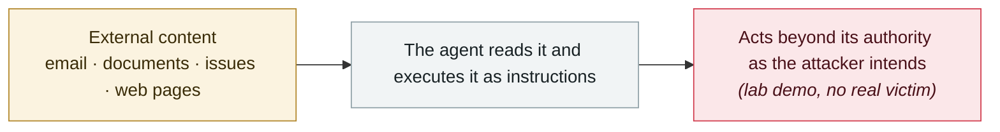

# Copilot Studio "Connected Agents" can carry invisible backdoors

     

## Summary

Zenity Labs: the feature (launched at Build 2025) lets agents share capabilities, and **once enabled it exposes one agent's knowledge, tools and topics to every other agent in the same environment** — and **① it is on by default for all new agents, ② no interface shows who has connected to your agent**. Attackers can use this to impersonate an organization and trigger sensitive operations unnoticed. Zenity's conclusion: "**Always assume that any agent with connected agents enabled is anonymously reachable from the entire internet**"

## Attack chain

## Sources

| # | Source | Link |
|---|---|---|
| 1 | eSecurity Planet | <https://www.esecurityplanet.com/artificial-intelligence/copilot-studio-feature-enables-silent-ai-backdoors/> |
| 2 | CybersecurityNews | <https://cybersecuritynews.com/hackers-exploit-copilot-studios-new-connected-agents-feature/> |

## Metadata

| Field | Value |
|---|---|
| Date | `2025-12-29` (raw: 2025-12-29, precision `day`) |
| Kind | Research demo `research` |
| Type | [`IPI`](../../taxonomy/types.md#ipi) Indirect prompt injection |
| Severity | **Medium** `medium` |
| Confidence | **A** — primary source (vendor / victim / law enforcement / official report) |
| Real harm | No |
| AI involvement | Confirmed `confirmed` |
| Region | [Global](../../regions/global.md) |
| Archive ID | `2025-12-29-copilot-studio-connected-agents` |

**Why this classification:** Controlled demo by a research lab or vendor, `real_harm: false`; the record marks when the attack surface became public. Rated `medium`: controlled demo, moderate flaw, or an incident limited to a single user / single machine. Grading criteria: see [taxonomy/severity.md](../../taxonomy/severity.md) and [taxonomy/confidence.md](../../taxonomy/confidence.md).

## Related

**Topic:** [Zero-click data exfiltration chain](../../topics/zero-click-exfil.md)

**Related records:**

- `2026-01-12` [Claude Cowork ships with known vulnerabilities](../2026-01/2026-01-12-claude-cowork-dai-zhe-zhi.md)   Claude Cowork ships with known vulnerabilities
- `2026-01-12` [Superhuman AI indirect prompt injection](../2026-01/2026-01-12-superhuman-jian-jie-ti-shi.md)   Superhuman AI indirect prompt injection
- `2026-01-14` [Microsoft Copilot Personal "Reprompt"](../2026-01/2026-01-14-microsoft-copilot-personal-reprompt.md)   Microsoft Copilot Personal "Reprompt"
- `2025-11-20` [ServiceNow Now Assist second-order prompt injection](../2025-11/2025-11-20-servicenow-now-assist.md)   ServiceNow Now Assist second-order prompt injection

---

[← 2025-12 index](README.md) · [← All records](../../README.md) · [Chinese](../i18n/zh/2025-12/2025-12-29-copilot-studio-connected-agents.md)

This record is part of the **Orca AI Incident Archive**, licensed [CC BY 4.0](../../LICENSE). Found a factual error or a missing source? [Open an issue or PR](../../CONTRIBUTING.md) — corrections are recorded in the record's revision history, never silently overwritten.
