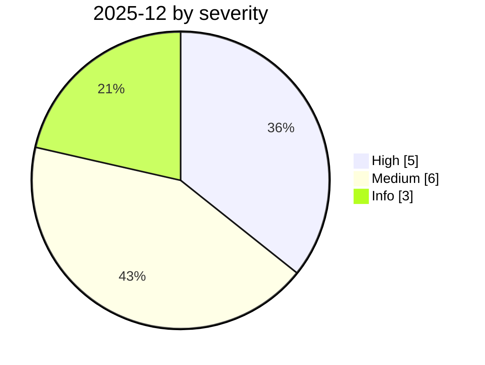

# 2025-12

<!-- BEGIN:summary -->
**14** records

   

## Records this month

| Date | Record | Type | Severity | Confidence | Real harm |
|---|---|---|---|---|---|
| `12-01` | [Claude Code deletes a Mac home directory, Keychain included](2025-12-01-claude-code-mac-keychain.md) | `ROGUE` | **High** | B | ✅ |
| `12-01` | [Cursor Plan Mode ignores "DO NOT RUN ANYTHING", deletes ~70 files](2025-12-01-cursor-plan-mode.md) | `ROGUE` | **High** | B | ✅ |
| `12-01` | [Three CVEs in Anthropic's Git MCP Server](2025-12-01-anthropic-git-mcp-server.md) ⚠️ | `MCP` | Medium | A | — |
| `12-01` | [LLM-driven humanoid robot jailbroken into firing a weapon](2025-12-01-llm-qu-dong-ren-xing.md) | `ROGUE` | Medium | B | — |
| `12-01` | [MCP TypeScript SDK DNS rebinding](2025-12-01-mcp-typescript-sdk-dns.md) | `MCP` | Medium | A | — |
| `12-06` | [IDEsaster](2025-12-06-idesaster.md) | `SANDBOX` `MCP` | Medium | A | — |
| `12-09` | [OWASP Top 10 for Agentic Applications 2026](2025-12-09-owasp-top-agentic-applications.md) | `GOV` | Info | A | · |
| `12-11` | [GPT-5.2 system card updates cyber capability](2025-12-11-gpt-xi-tong-ka-wang.md) | `GOV` | Info | A | · |
| `12-15` | [Amazon Kiro triggers a 13-hour AWS outage](2025-12-15-amazon-kiro-aws.md) ⚠️ | `ROGUE` | **High** | B | ✅ |
| `12-15` | ["Privacy" browser extensions resell AI conversations](2025-12-15-yin-si-liu-lan-qi.md) | `CRED` | **High** | A | ✅ |
| `12-22` | [OpenAI: browser prompt injection "may never be fully solved"](2025-12-22-liu-lan-qi-ti-shi.md) | `GOV` | Info | A | · |
| `12-28` | [Mexico government intrusion campaign begins](2025-12-28-mexico-government-intrusion-begins.md) | `WEAPON` | Medium | A | ✅ |
| `12-29` | [Copilot Studio "Connected Agents" can carry invisible backdoors](2025-12-29-copilot-studio-connected-agents.md) | `IPI` | Medium | A | — |
| `12-30` | [Chrome extensions steal ChatGPT and DeepSeek conversations](2025-12-30-chrome-chatgpt-deepseek.md) | `CRED` | **High** | A | ✅ |

★ = `critical` · ⚠️ = disputed facts or attribution · real harm: ✅ confirmed victim / — none / · not applicable (policy and intelligence reports)
<!-- END:summary -->

## This month in review

### 2025 year-end observation (quoted from the afterword of the IPA 2025-12 issue, translated from the Japanese)

> "From this autumn through the end of the year, events that can be called AI security incidents occurred in large numbers, and the importance of AI security as a subject area has finally become tangible. The number of cases is on a rising trend ... **a quarterly or bimonthly cadence can no longer keep up**, and we are studying changes to our current form of information provision."

This line can serve directly as the epigraph for the repository README: **even a national-level institution can no longer keep up with the update cadence, so a community-maintained public database is needed.**
(Corroborating fact: the IPA 2025-12 issue was only **4 pages**; the 2026-08 issue grew to **58 pages**.)

<!-- BEGIN:nav -->
---

[← 2025-11](../2025-11/README.md) · [Archive index](../../README.md) · [By type](../../taxonomy/types.md) · [2026-01 →](../2026-01/README.md)
<!-- END:nav -->
