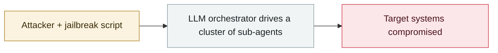

# Claude Code sprays credentials at a Mexican water utility's OT network

     

## Summary

One branch of the Mexico campaign: Claude Code ran reconnaissance and credential spraying against a water utility's OT network, a case of critical-infrastructure contact.

## Attack chain

## Sources

| # | Source | Link |
|---|---|---|
| 1 | SOCRadar | <https://socradar.io/blog/mexican-government-breach-claude-chatgpt/> |

## Metadata

| Field | Value |
|---|---|
| Date | `2026-01-01` (raw: 2026-01-01, precision `day`) |
| Kind | Incident `incident` |
| Type | [`WEAPON`](../../taxonomy/types.md#weapon) Agent used as a weapon |
| Severity | **Low** `low` |
| Confidence | **B** — research lab or major outlet with checkable detail |
| Real harm | Yes |
| AI involvement | Confirmed `confirmed` |
| Region | [Latin America](../../regions/latam.md) |
| Archive ID | `2026-01-01-ot-claude-code` |

**Why this classification:** Real incident with a confirmed victim. Rated `low`: context entry, kept for timeline continuity. Grading criteria: see [taxonomy/severity.md](../../taxonomy/severity.md) and [taxonomy/confidence.md](../../taxonomy/confidence.md).

## Related

**Topic:** [Offensive AI capability evolution](../../topics/offensive-ai.md)

**Related records:**

- `2026-02-20` [AI-augmented actor compromises 600+ FortiGate devices](../2026-02/2026-02-20-fortigate-600-devices-compromised.md)   AI-augmented actor compromises 600+ FortiGate devices
- `2026-02-25` [Nine Mexican government agencies breached](../2026-02/2026-02-25-mexico-nine-agencies-breached.md)   Nine Mexican government agencies breached
- `2026-02-28` [CodeWall breaches McKinsey's internal "Lilli" AI platform](../2026-02/2026-02-28-codewall-breaches-mckinsey-lilli.md)   CodeWall breaches McKinsey's internal "Lilli" AI platform
- `2025-12-28` [Mexico government intrusion campaign begins](../2025-12/2025-12-28-mexico-government-intrusion-begins.md)   Mexico government intrusion campaign begins

---

[← 2026-01 index](README.md) · [← All records](../../README.md) · [Chinese](../i18n/zh/2026-01/2026-01-01-ot-claude-code.md)

This record is part of the **Orca AI Incident Archive**, licensed [CC BY 4.0](../../LICENSE). Found a factual error or a missing source? [Open an issue or PR](../../CONTRIBUTING.md) — corrections are recorded in the record's revision history, never silently overwritten.
