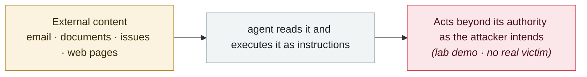

# Four productivity tools hit the lethal trifecta in nine days

     

## Summary

The four products are **IBM Bob, Superhuman AI, Notion AI and Anthropic Claude Cowork**, and the attack pattern is identical: private data + untrusted content + outbound capability. **None is a proof of concept — all are real-world exploitation of products in use at Fortune 500 companies, healthcare providers and government contractors**; the common trait is that **the data was already taken before the user could intervene**

⚠️ Superhuman and Cowork have separate records of their own in this archive; **do not double-count them when entering records**

## Attack chain

## Sources

| # | Source | Link |
|---|---|---|
| 1 | breached.company | <https://breached.company/the-lethal-trifecta-strikes-four-major-ai-agent-vulnerabilities-in-five-days/> |

## Metadata

| Field | Value |
|---|---|
| Date | `2026-01-07` → `2026-01-15` (raw: 2026-01-07→15, precision `day`) |
| Kind | Research demo `research` |
| Type | [`IPI`](../../taxonomy/types.md#ipi) Indirect prompt injection |
| Severity | **Medium** `medium` |
| Confidence | **B** — research lab or major outlet with checkable detail |
| Real harm | No |
| AI involvement | Confirmed `confirmed` |
| Region | [Global](../../regions/global.md) |
| Archive ID | `2026-01-07-lethal-trifecta-four-tools` |

**Why this classification:** Controlled demo by a research lab or vendor, `real_harm: false`; the record marks when the attack surface became public. Rated `medium`: controlled demo, moderate flaw, or an incident limited to a single user / single machine. Grading criteria: see [taxonomy/severity.md](../../taxonomy/severity.md) and [taxonomy/confidence.md](../../taxonomy/confidence.md).

## Related

**Topic:** [Zero-click data exfiltration chain](../../topics/zero-click-exfil.md)

**Related records:**

- `2026-01-12` [Claude Cowork ships with known vulnerabilities](2026-01-12-claude-cowork-dai-zhe-zhi.md)   Claude Cowork ships with known vulnerabilities
- `2026-01-12` [Superhuman AI indirect prompt injection](2026-01-12-superhuman-jian-jie-ti-shi.md)   Superhuman AI indirect prompt injection
- `2026-01-14` [Microsoft Copilot Personal "Reprompt"](2026-01-14-microsoft-copilot-personal-reprompt.md)   Microsoft Copilot Personal "Reprompt"
- `2026-02-09` [Clinejection](../2026-02/2026-02-09-clinejection.md)   Clinejection

---

[← 2026-01 index](README.md) · [← All records](../../README.md) · [Chinese](../i18n/zh/2026-01/2026-01-07-lethal-trifecta-four-tools.md)

This record is part of the **Orca AI Incident Archive**, licensed [CC BY 4.0](../../LICENSE). Found a factual error or a missing source? [Open an issue or PR](../../CONTRIBUTING.md) — corrections are recorded in the record's revision history, never silently overwritten.
