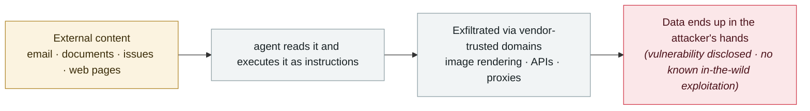

# Claude Cowork ships with known vulnerabilities

      

## Summary

Cowork shipped on 01-12 and opened to all $20/month Pro users four days later. **Within 48 hours** PromptArmor showed that a Word document containing a 1pt white-text prompt injection was enough to make Cowork upload the user's financial files (**including partial Social Security numbers**) to the attacker's Anthropic account — no exploit, no malware, the user merely opened the file.

⚠️ **The key point is that this was not an accident**: the underlying prompt injection flaw had been reported to Anthropic and confirmed **three months before** Cowork shipped, and **was still unfixed at release**; Anthropic had confirmed the defect as early as **2025-10-30**. The flaw was rated **CVSS 10/10**. Anthropic's written response was that the defect "**falls outside our current threat model**", and it advised users not to connect Cowork to sensitive documents

⚠️ IPA issue 2026-03 tags this record `[2025-05]`, which contradicts the release date and appears to be a typo

## Attack chain

## Sources

| # | Source | Link |
|---|---|---|
| 1 | PromptArmor | <https://www.promptarmor.com/resources/claude-cowork-exfiltrates-files> |
| 2 | GovInfoSecurity | <https://www.govinfosecurity.com/anthropics-cowork-shipped-known-vulnerability-a-30553> |
| 3 | Security Boulevard | <https://securityboulevard.com/2026/01/vulnerability-in-anthropics-claude-code-shows-up-in-cowork/> |

## Metadata

| Field | Value |
|---|---|
| Date | `2026-01-12` (raw: 2026-01-12, precision `day`) |
| Kind | Vulnerability disclosure `vulnerability` |
| Type | [`IPI`](../../taxonomy/types.md#ipi) Indirect prompt injection · [`EXFIL`](../../taxonomy/types.md#exfil) Data exfiltration |
| Severity | **High** `high` |
| Confidence | **A** — primary source (vendor / victim / law enforcement / official report) |
| Real harm | No |
| AI involvement | Confirmed `confirmed` |
| Region | [Global](../../regions/global.md) |
| Archive ID | `2026-01-12-claude-cowork-dai-zhe-zhi` |

**Why this classification:** Vulnerability disclosure; as of archiving there is no evidence of in-the-wild exploitation, so `real_harm: false`. Rated `high`: real damage is limited in scope, or it is a CVSS 9+ severe flaw, or a capability demonstration of significance. Grading criteria: see [taxonomy/severity.md](../../taxonomy/severity.md) and [taxonomy/confidence.md](../../taxonomy/confidence.md).

## Related

**Topic:** [Zero-click data exfiltration chain](../../topics/zero-click-exfil.md)

**Related records:**

- `2026-01-12` [Superhuman AI indirect prompt injection](2026-01-12-superhuman-jian-jie-ti-shi.md)   Superhuman AI indirect prompt injection
- `2026-01-14` [Microsoft Copilot Personal "Reprompt"](2026-01-14-microsoft-copilot-personal-reprompt.md)   Microsoft Copilot Personal "Reprompt"
- `2026-01-07` [Four productivity tools hit the lethal trifecta in nine days](2026-01-07-lethal-trifecta-four-tools.md)   Four productivity tools hit the lethal trifecta in nine days
- `2026-02-09` [Clinejection](../2026-02/2026-02-09-clinejection.md)   Clinejection

---

[← 2026-01 index](README.md) · [← All records](../../README.md) · [Chinese](../i18n/zh/2026-01/2026-01-12-claude-cowork-dai-zhe-zhi.md)

This record is part of the **Orca AI Incident Archive**, licensed [CC BY 4.0](../../LICENSE). Found a factual error or a missing source? [Open an issue or PR](../../CONTRIBUTING.md) — corrections are recorded in the record's revision history, never silently overwritten.
