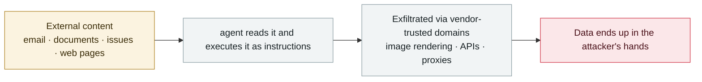

# Superhuman AI indirect prompt injection

      

## Summary

PromptArmor: zero-interaction exfiltration of inbox data via **Google Forms prefill links** plus automatic Markdown image rendering, which bypasses CSP. Superhuman's security team fixed it quickly (including Superhuman Go)

## Attack chain

## Sources

| # | Source | Link |
|---|---|---|
| 1 | PromptArmor | <https://www.promptarmor.com/resources/superhuman-ai-exfiltrates-emails> |

## Metadata

| Field | Value |
|---|---|
| Date | `2026-01-12` (raw: 2026-01-12, precision `day`) |
| Kind | Incident `incident` |
| Type | [`IPI`](../../taxonomy/types.md#ipi) Indirect prompt injection · [`EXFIL`](../../taxonomy/types.md#exfil) Data exfiltration |
| Severity | **High** `high` |
| Confidence | **A** — primary source (vendor / victim / law enforcement / official report) |
| Real harm | No |
| AI involvement | Confirmed `confirmed` |
| Region | [Global](../../regions/global.md) |
| Archive ID | `2026-01-12-superhuman-jian-jie-ti-shi` |

**Why this classification:** Real incident without a confirmed specific victim. Rated `high`: real damage is limited in scope, or it is a CVSS 9+ severe flaw, or a capability demonstration of significance. Grading criteria: see [taxonomy/severity.md](../../taxonomy/severity.md) and [taxonomy/confidence.md](../../taxonomy/confidence.md).

## Related

**Topic:** [Zero-click data exfiltration chain](../../topics/zero-click-exfil.md)

**Related records:**

- `2026-01-12` [Claude Cowork ships with known vulnerabilities](2026-01-12-claude-cowork-dai-zhe-zhi.md)   Claude Cowork ships with known vulnerabilities
- `2026-01-14` [Microsoft Copilot Personal "Reprompt"](2026-01-14-microsoft-copilot-personal-reprompt.md)   Microsoft Copilot Personal "Reprompt"
- `2026-01-07` [Four productivity tools hit the lethal trifecta in nine days](2026-01-07-lethal-trifecta-four-tools.md)   Four productivity tools hit the lethal trifecta in nine days
- `2026-02-09` [Clinejection](../2026-02/2026-02-09-clinejection.md)   Clinejection

---

[← 2026-01 index](README.md) · [← All records](../../README.md) · [Chinese](../i18n/zh/2026-01/2026-01-12-superhuman-jian-jie-ti-shi.md)

This record is part of the **Orca AI Incident Archive**, licensed [CC BY 4.0](../../LICENSE). Found a factual error or a missing source? [Open an issue or PR](../../CONTRIBUTING.md) — corrections are recorded in the record's revision history, never silently overwritten.
