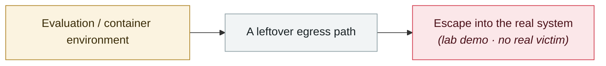

# Cursor allowlist bypass CVE-2026-22708

     

## Summary

Pillar Security: in Auto-Run + Allowlist mode, **shell built-ins (`export`, `typeset`, `unset`, `set`, etc.) bypass allowlist validation entirely** — external commands are validated, but built-ins are let through because they are not standalone executables, **even when the user's allowlist is empty**. An attacker poisons the shell environment via direct or indirect prompt injection (setting / modifying / deleting environment variables that affect trusted commands), achieving both zero-click and one-click RCE. **Fixed in Cursor 2.3**, which now requires explicit approval for commands the server-side parser cannot classify

## Attack chain

## Sources

| # | Source | Link |
|---|---|---|
| 1 | Pillar Security | <https://www.pillar.security/blog/the-agent-security-paradox-when-trusted-commands-in-cursor-become-attack-vectors> |
| 2 | SC Media | <https://www.scworld.com/news/cursor-vulnerability-enables-stealthy-rce-via-indirect-prompt-injection> |

## Metadata

| Field | Value |
|---|---|
| Date | `2026-01-14` (raw: 2026-01-14, precision `day`) |
| Kind | Research demo `research` |
| Type | [`SANDBOX`](../../taxonomy/types.md#sandbox) Sandbox escape |
| Severity | **Medium** `medium` |
| Confidence | **A** — primary source (vendor / victim / law enforcement / official report) |
| Real harm | No |
| AI involvement | Confirmed `confirmed` |
| Region | [Global](../../regions/global.md) |
| Archive ID | `2026-01-14-cursor-bai-ming-dan-rao` |

**Why this classification:** Controlled demo by a research lab or vendor, `real_harm: false`; the record marks when the attack surface became public. Rated `medium`: controlled demo, moderate flaw, or an incident limited to a single user / single machine. Grading criteria: see [taxonomy/severity.md](../../taxonomy/severity.md) and [taxonomy/confidence.md](../../taxonomy/confidence.md).

## Related

**Topic:** [Frontier model autonomous overreach](../../topics/eval-escapes.md)

**Related records:**

- `2026-02-27` [Check Point publishes two Claude Code CVEs](../2026-02/2026-02-27-check-point-claude-code.md)   Check Point publishes two Claude Code CVEs
- `2025-12-06` [IDEsaster](../2025-12/2025-12-06-idesaster.md)   IDEsaster
- `2026-04-15` [Windsurf zero-click MCP RCE (CVE-2026-30615)](../2026-04/2026-04-15-windsurf-mcp-rce.md)   Windsurf zero-click MCP RCE (CVE-2026-30615)
- `2026-04-24` [Gemini CLI CVSS 10.0: one pull request compromises CI](../2026-04/2026-04-24-gemini-cli-pr-ci.md)   Gemini CLI CVSS 10.0: one pull request compromises CI

---

[← 2026-01 index](README.md) · [← All records](../../README.md) · [Chinese](../i18n/zh/2026-01/2026-01-14-cursor-bai-ming-dan-rao.md)

This record is part of the **Orca AI Incident Archive**, licensed [CC BY 4.0](../../LICENSE). Found a factual error or a missing source? [Open an issue or PR](../../CONTRIBUTING.md) — corrections are recorded in the record's revision history, never silently overwritten.
