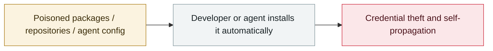

# Malicious ClawHub skills surge

     

## Summary

Grew from 28 to 386 in four days, disguised as cryptocurrency tools

## Attack chain

## Sources

| # | Source | Link |
|---|---|---|
| 1 | Theori 2026 H1 roundup | <https://theori.io/ko/blog/2026-h1-hot-security-issue-case> |

## Metadata

| Field | Value |
|---|---|
| Date | `2026-01-25` (raw: late 2026-01, precision `part`) |
| Kind | Incident `incident` |
| Type | [`SUPPLY`](../../taxonomy/types.md#supply) Supply-chain poisoning |
| Severity | **High** `high` |
| Confidence | **B** — research lab or major outlet with checkable detail |
| Real harm | Yes |
| AI involvement | Confirmed `confirmed` |
| Region | [Global](../../regions/global.md) |
| Archive ID | `2026-01-25-clawhub-skill-e-yi-ji` |

**Why this classification:** Real incident with a confirmed victim. Rated `high`: real damage is limited in scope, or it is a CVSS 9+ severe flaw, or a capability demonstration of significance. Grading criteria: see [taxonomy/severity.md](../../taxonomy/severity.md) and [taxonomy/confidence.md](../../taxonomy/confidence.md).

## Related

**Topic:** [Agent supply-chain poisoning](../../topics/agent-supply-chain.md)

**Related records:**

- `2026-02-09` [Clinejection](../2026-02/2026-02-09-clinejection.md)   Clinejection
- `2026-02-01` [ClawHavoc campaign](../2026-02/2026-02-01-clawhavoc-zhan-yi.md)   ClawHavoc campaign
- `2025-11-21` [Shai-Hulud 2.0](../2025-11/2025-11-21-shai-hulud.md)   Shai-Hulud 2.0
- `2026-03-01` [Hades: a sustained campaign turning AI coding assistants into the attack surface](../2026-03/2026-03-01-hades-campaign-ai-coding-assistants.md)   Hades: a sustained campaign turning AI coding assistants into the attack surface

---

[← 2026-01 index](README.md) · [← All records](../../README.md) · [Chinese](../i18n/zh/2026-01/2026-01-25-clawhub-skill-e-yi-ji.md)

This record is part of the **Orca AI Incident Archive**, licensed [CC BY 4.0](../../LICENSE). Found a factual error or a missing source? [Open an issue or PR](../../CONTRIBUTING.md) — corrections are recorded in the record's revision history, never silently overwritten.
