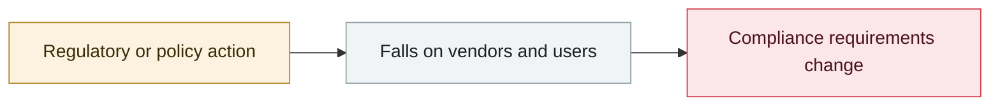

# Clawdbot to Moltbot to OpenClaw: two renames

     

## Summary

Anthropic's trademark team asked for a rename because "Clawdbot" sounds similar to "Claude"

## Attack chain

## Sources

| # | Source | Link |
|---|---|---|
| 1 | Wikipedia | <https://en.wikipedia.org/wiki/OpenClaw> |
| 2 | CNBC | <https://www.cnbc.com/2026/02/02/openclaw-open-source-ai-agent-rise-controversy-clawdbot-moltbot-moltbook.html> |

## Metadata

| Field | Value |
|---|---|
| Date | `2026-01-26` (raw: 2026-01-26 / 01-29, precision `day`) |
| Kind | Policy & regulation `policy` |
| Type | [`OTHER`](../../taxonomy/types.md#other) Other |
| Severity | **Info** `info` |
| Confidence | **A** — primary source (vendor / victim / law enforcement / official report) |
| Real harm | n/a |
| AI involvement | Confirmed `confirmed` |
| Region | [Global](../../regions/global.md) |
| Archive ID | `2026-01-26-clawdbot-moltbot-openclaw` |

**Why this classification:** Policy / regulatory action, not counted in incident statistics; `severity` is recorded as `info`. Grading criteria: see [taxonomy/severity.md](../../taxonomy/severity.md) and [taxonomy/confidence.md](../../taxonomy/confidence.md).

---

[← 2026-01 index](README.md) · [← All records](../../README.md) · [Chinese](../i18n/zh/2026-01/2026-01-26-clawdbot-moltbot-openclaw.md)

This record is part of the **Orca AI Incident Archive**, licensed [CC BY 4.0](../../LICENSE). Found a factual error or a missing source? [Open an issue or PR](../../CONTRIBUTING.md) — corrections are recorded in the record's revision history, never silently overwritten.
