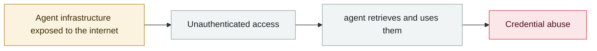

# Clawdbot gateways exposed at scale

      

## Summary

Behind a reverse proxy `X-Forwarded-For` is not handled correctly, so the "auto-approve localhost" check is fooled → **900+ instances** expose the Control UI to unauthenticated remote access, leaking Anthropic/Slack/Telegram API keys and months of conversation history, with **RCE as root** possible. Recommendations: configure `gateway.trustedProxies`, enable password authentication, rotate all credentials

## Attack chain

## Sources

| # | Source | Link |
|---|---|---|
| 1 | CybersecurityNews | <https://cybersecuritynews.com/clawdbot-chats-exposed/> |
| 2 | Original discovery (X) | <https://x.com/theonejvo/status/2015401219746128322> |

## Metadata

| Field | Value |
|---|---|
| Date | `2026-01-26` (raw: 2026-01-26, precision `day`) |
| Kind | Incident `incident` |
| Type | [`INFRA`](../../taxonomy/types.md#infra) Agent infrastructure exposure · [`CRED`](../../taxonomy/types.md#cred) Credential abuse |
| Severity | **High** `high` |
| Confidence | **A** — primary source (vendor / victim / law enforcement / official report) |
| Real harm | Yes |
| AI involvement | Confirmed `confirmed` |
| Region | [Global](../../regions/global.md) |
| Archive ID | `2026-01-26-clawdbot-wang-guan-gui-mo` |

**Why this classification:** Real incident with a confirmed victim. Rated `high`: real damage is limited in scope, or it is a CVSS 9+ severe flaw, or a capability demonstration of significance. Grading criteria: see [taxonomy/severity.md](../../taxonomy/severity.md) and [taxonomy/confidence.md](../../taxonomy/confidence.md).

## Related

**Topic:** [Agent infrastructure exposure](../../topics/agent-infra.md)

**Related records:**

- `2026-01-31` [Moltbook database fully open](2026-01-31-moltbook-open-database.md)   Moltbook database fully open
- `2026-01-29` [OpenClaw Control UI WebSocket hijack RCE](2026-01-29-openclaw-control-ui-websocket.md)   OpenClaw Control UI WebSocket hijack RCE
- `2026-01-31` [Step Finance treasury drained](2026-01-31-step-finance-jin-ku-dao.md)   Step Finance treasury drained
- `2026-02-28` [CodeWall breaches McKinsey's internal "Lilli" AI platform](../2026-02/2026-02-28-codewall-breaches-mckinsey-lilli.md)   CodeWall breaches McKinsey's internal "Lilli" AI platform

---

[← 2026-01 index](README.md) · [← All records](../../README.md) · [Chinese](../i18n/zh/2026-01/2026-01-26-clawdbot-wang-guan-gui-mo.md)

This record is part of the **Orca AI Incident Archive**, licensed [CC BY 4.0](../../LICENSE). Found a factual error or a missing source? [Open an issue or PR](../../CONTRIBUTING.md) — corrections are recorded in the record's revision history, never silently overwritten.
