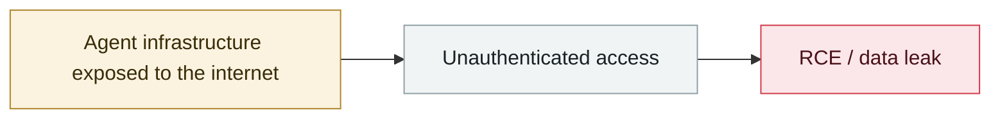

# OpenClaw Control UI WebSocket hijack RCE

     

## Summary

Early discovery ahead of CVE-2026-25253

## Attack chain

## Sources

| # | Source | Link |
|---|---|---|
| 1 | Permission Protocol tracker | <https://www.permissionprotocol.com/agent-incident-tracker> |

## Metadata

| Field | Value |
|---|---|
| Date | `2026-01-29` (raw: 2026-01-29, precision `day`) |
| Kind | Incident `incident` |
| Type | [`INFRA`](../../taxonomy/types.md#infra) Agent infrastructure exposure |
| Severity | **High** `high` |
| Confidence | **B** — research lab or major outlet with checkable detail |
| Real harm | No |
| AI involvement | Confirmed `confirmed` |
| Region | [Global](../../regions/global.md) |
| Archive ID | `2026-01-29-openclaw-control-ui-websocket` |

**Why this classification:** Real incident without a confirmed specific victim. Rated `high`: real damage is limited in scope, or it is a CVSS 9+ severe flaw, or a capability demonstration of significance. Grading criteria: see [taxonomy/severity.md](../../taxonomy/severity.md) and [taxonomy/confidence.md](../../taxonomy/confidence.md).

## Related

**Topic:** [Agent infrastructure exposure](../../topics/agent-infra.md)

**Related records:**

- `2026-01-26` [Clawdbot gateways exposed at scale](2026-01-26-clawdbot-wang-guan-gui-mo.md)   Clawdbot gateways exposed at scale
- `2026-02-28` [CodeWall breaches McKinsey's internal "Lilli" AI platform](../2026-02/2026-02-28-codewall-breaches-mckinsey-lilli.md)   CodeWall breaches McKinsey's internal "Lilli" AI platform
- `2026-02-10` [15,200 OpenClaw control panels exposed](../2026-02/2026-02-10-openclaw-kong-zhi-mian-ban.md)   15,200 OpenClaw control panels exposed
- `2026-02-25` [OpenClaw ClawJacked (CVE-2026-25253)](../2026-02/2026-02-25-openclaw-clawjacked.md)   OpenClaw ClawJacked (CVE-2026-25253)

---

[← 2026-01 index](README.md) · [← All records](../../README.md) · [Chinese](../i18n/zh/2026-01/2026-01-29-openclaw-control-ui-websocket.md)

This record is part of the **Orca AI Incident Archive**, licensed [CC BY 4.0](../../LICENSE). Found a factual error or a missing source? [Open an issue or PR](../../CONTRIBUTING.md) — corrections are recorded in the record's revision history, never silently overwritten.
