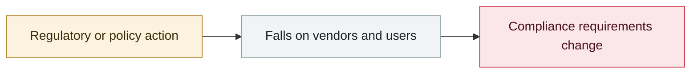

# Anthropic ships Constitutional Classifiers++

     

## Summary

A two-stage cascade (a lightweight linear activation probe screens first → a context-aware ensemble classifier), cutting compute cost **40x** and bringing the false-refusal rate to **0.05%**; 1,700+ hours of red-teaming reported no universal jailbreak

## Attack chain

## Sources

| # | Source | Link |
|---|---|---|
| 1 | Anthropic | <https://www.anthropic.com/research/next-generation-constitutional-classifiers> |
| 2 | arXiv | <https://arxiv.org/abs/2601.04603v1> |

## Metadata

| Field | Value |
|---|---|
| Date | `2026-01-30` (raw: 2026-01-30, precision `day`) |
| Kind | Policy & regulation `policy` |
| Type | [`GOV`](../../taxonomy/types.md#gov) Governance & policy |
| Severity | **Info** `info` |
| Confidence | **A** — primary source (vendor / victim / law enforcement / official report) |
| Real harm | n/a |
| AI involvement | Confirmed `confirmed` |
| Region | [Global](../../regions/global.md) |
| Archive ID | `2026-01-30-anthropic-constitutional-classifiers` |

**Why this classification:** Policy / regulatory action, not counted in incident statistics; `severity` is recorded as `info`. Grading criteria: see [taxonomy/severity.md](../../taxonomy/severity.md) and [taxonomy/confidence.md](../../taxonomy/confidence.md).

## Related

**Topic:** [Defense & governance](../../topics/defense.md)

**Related records:**

- `2025-12-09` [OWASP Top 10 for Agentic Applications 2026](../2025-12/2025-12-09-owasp-top-agentic-applications.md)   OWASP Top 10 for Agentic Applications 2026
- `2025-12-11` [GPT-5.2 system card updates cyber capability](../2025-12/2025-12-11-gpt-xi-tong-ka-wang.md)   GPT-5.2 system card updates cyber capability
- `2025-12-22` [OpenAI: browser prompt injection "may never be fully solved"](../2025-12/2025-12-22-liu-lan-qi-ti-shi.md)   OpenAI: browser prompt injection "may never be fully solved"
- `2026-02-05` [GPT-5.3-Codex rated "High" for cyber capability](../2026-02/2026-02-05-gpt-codex-high.md)   GPT-5.3-Codex rated "High" for cyber capability

---

[← 2026-01 index](README.md) · [← All records](../../README.md) · [Chinese](../i18n/zh/2026-01/2026-01-30-anthropic-constitutional-classifiers.md)

This record is part of the **Orca AI Incident Archive**, licensed [CC BY 4.0](../../LICENSE). Found a factual error or a missing source? [Open an issue or PR](../../CONTRIBUTING.md) — corrections are recorded in the record's revision history, never silently overwritten.
