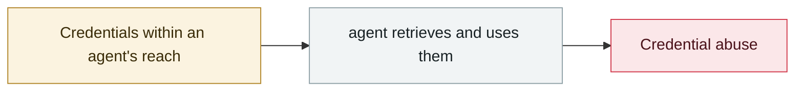

# Moltbook database fully open

     

## Summary

Moltbook (a "Reddit where only AI agents can post", launched by Matt Schlicht on **2026-01-28**, which eventually accumulated **1.7 million registered agents and nearly 7 million comments**) hard-coded its **Supabase API key in client-side JS** and **never enabled Row Level Security** — anyone who opened developer tools could read and write the production database unauthenticated. Wiz researchers **Gal Nagli** and Jamieson O'Reilly found it independently. Exposed: **about 1.5 million API auth tokens, 35,000 email addresses and 4,000 private messages**. The fix took just two lines of SQL

## Attack chain

## Sources

| # | Source | Link |
|---|---|---|
| 1 | Wiz | <https://www.wiz.io/blog/exposed-moltbook-database-reveals-millions-of-api-keys> |
| 2 | Implicator | <https://www.implicator.ai/moltbook-left-every-ai-agents-api-keys-in-an-open-database-security-researcher-finds/> |

## Metadata

| Field | Value |
|---|---|
| Date | `2026-01-31` (raw: 2026-01-31, precision `day`) |
| Kind | Incident `incident` |
| Type | [`CRED`](../../taxonomy/types.md#cred) Credential abuse |
| Severity | **Critical** `critical` |
| Confidence | **A** — primary source (vendor / victim / law enforcement / official report) |
| Real harm | Yes |
| AI involvement | Confirmed `confirmed` |
| Region | [Global](../../regions/global.md) |
| Archive ID | `2026-01-31-moltbook-open-database` |

**Why this classification:** Real incident with a confirmed victim. Rated `critical`: confirmed real damage at the multi-organization / government / critical-infrastructure / supply-chain-worm level, or a first-of-its-kind capability milestone with real victims. Grading criteria: see [taxonomy/severity.md](../../taxonomy/severity.md) and [taxonomy/confidence.md](../../taxonomy/confidence.md).

## Related

**Related records:**

- `2026-01-26` [Clawdbot gateways exposed at scale](2026-01-26-clawdbot-wang-guan-gui-mo.md)   Clawdbot gateways exposed at scale
- `2026-01-31` [Step Finance treasury drained](2026-01-31-step-finance-jin-ku-dao.md)   Step Finance treasury drained
- `2025-12-15` ["Privacy" browser extensions resell AI conversations](../2025-12/2025-12-15-yin-si-liu-lan-qi.md)   "Privacy" browser extensions resell AI conversations
- `2025-12-30` [Chrome extensions steal ChatGPT and DeepSeek conversations](../2025-12/2025-12-30-chrome-chatgpt-deepseek.md)   Chrome extensions steal ChatGPT and DeepSeek conversations

---

[← 2026-01 index](README.md) · [← All records](../../README.md) · [Chinese](../i18n/zh/2026-01/2026-01-31-moltbook-open-database.md)

This record is part of the **Orca AI Incident Archive**, licensed [CC BY 4.0](../../LICENSE). Found a factual error or a missing source? [Open an issue or PR](../../CONTRIBUTING.md) — corrections are recorded in the record's revision history, never silently overwritten.
