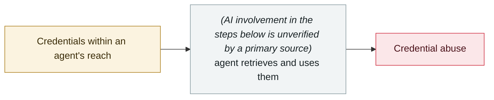

# Step Finance treasury drained

     

> [!WARNING]
> **This record contains disputed or not fully confirmed facts**; the claims of each party are kept side by side in the body, so do not cite any single one of them in isolation.
> **AI involvement is not confirmed by a primary source** — the record is kept so that an item widely circulated as an AI incident, but in fact unverified, can be found and checked, not to endorse it.
> **Confidence D** — key facts or attribution are disputed.

## Summary

Solana DeFi platform Step Finance disclosed a security incident: after gaining access to an executive's device, the attacker moved the staking authority over the treasury wallet, and **261,854 SOL (about $27–30M)** was unstaked and transferred out. The token crashed nearly 97%, the project shut down in 2026-02, and only about $4.7 million was recovered.

⚠️ **CoinDesk states plainly that it did not say how the attacker gained access, and the article never mentions AI**. The claim that "the AI trading agent held authority to make large transfers without approval" **appears only in AI marketing blogs and has no primary-source support**. **Recommendation: either drop it, or label it "AI involvement unverified"**

> [!NOTE]
> CoinDesk's primary report does not mention AI at all. This record is kept in the archive so that the fact that second-hand channels have passed it off as an AI incident can be found and rebutted, not to corroborate it.

## Attack chain

## Sources

| # | Source | Link |
|---|---|---|
| 1 | CoinDesk | <https://www.coindesk.com/business/2026/01/31/solana-based-defi-platform-step-finance-hit-by-usd30-million-treasury-hack-as-token-price-craters> |
| 2 | Halborn | <https://www.halborn.com/blog/post/explained-the-step-finance-hack-january-2026> |

## Metadata

| Field | Value |
|---|---|
| Date | `2026-01-31` (raw: 2026-01-31, precision `day`) |
| Kind | Incident `incident` |
| Type | [`CRED`](../../taxonomy/types.md#cred) Credential abuse |
| Severity | **High** `high` |
| Confidence | **D** — key facts or attribution disputed |
| Real harm | Yes |
| AI involvement | Unverified `unverified` |
| Region | [Global](../../regions/global.md) |
| Archive ID | `2026-01-31-step-finance-jin-ku-dao` |

**Why this classification:** Real incident with a confirmed victim. Rated `high`: real damage is limited in scope, or it is a CVSS 9+ severe flaw, or a capability demonstration of significance. Grading criteria: see [taxonomy/severity.md](../../taxonomy/severity.md) and [taxonomy/confidence.md](../../taxonomy/confidence.md).

## Related

**Related records:**

- `2026-01-31` [Moltbook database fully open](2026-01-31-moltbook-open-database.md)   Moltbook database fully open
- `2026-01-26` [Clawdbot gateways exposed at scale](2026-01-26-clawdbot-wang-guan-gui-mo.md)   Clawdbot gateways exposed at scale
- `2025-12-15` ["Privacy" browser extensions resell AI conversations](../2025-12/2025-12-15-yin-si-liu-lan-qi.md)   "Privacy" browser extensions resell AI conversations
- `2025-12-30` [Chrome extensions steal ChatGPT and DeepSeek conversations](../2025-12/2025-12-30-chrome-chatgpt-deepseek.md)   Chrome extensions steal ChatGPT and DeepSeek conversations

---

[← 2026-01 index](README.md) · [← All records](../../README.md) · [Chinese](../i18n/zh/2026-01/2026-01-31-step-finance-jin-ku-dao.md)

This record is part of the **Orca AI Incident Archive**, licensed [CC BY 4.0](../../LICENSE). Found a factual error or a missing source? [Open an issue or PR](../../CONTRIBUTING.md) — corrections are recorded in the record's revision history, never silently overwritten.
