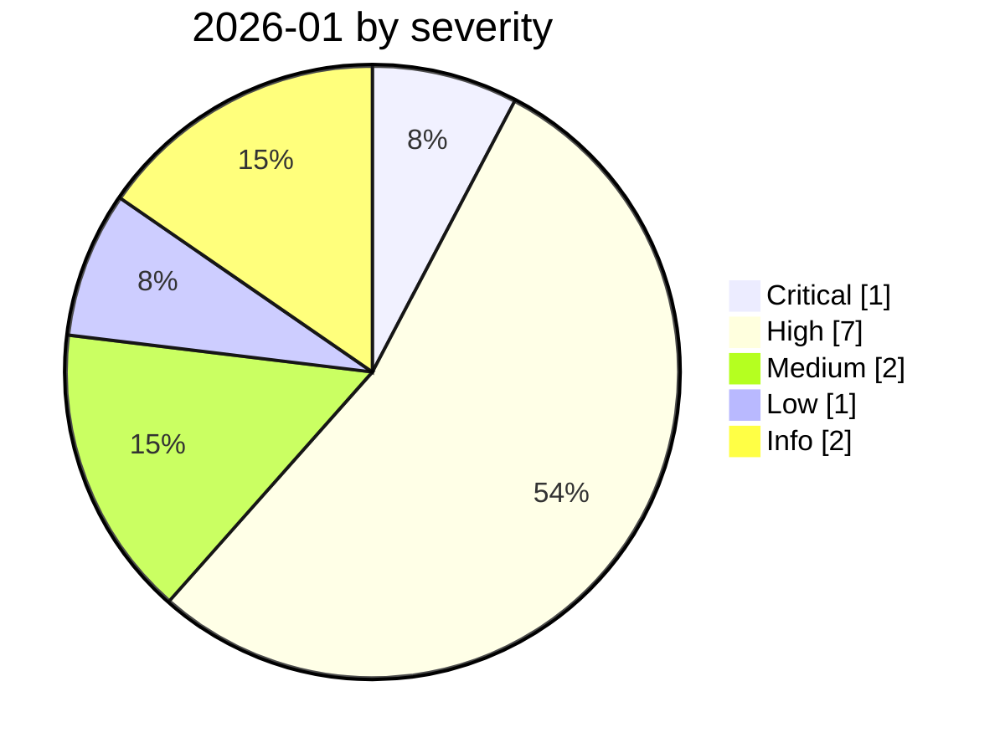

# 2026-01

<!-- BEGIN:summary -->
**13** records

     

## Records this month

| Date | Record | Type | Severity | Confidence | Real harm |
|---|---|---|---|---|---|
| `01-01` | [Claude Code sprays credentials at a Mexican water utility's OT network](2026-01-01-ot-claude-code.md) | `WEAPON` | Low | B | ✅ |
| `01-07` | [Four productivity tools hit the lethal trifecta in nine days](2026-01-07-lethal-trifecta-four-tools.md) | `IPI` | Medium | B | — |
| `01-12` | [Claude Cowork ships with known vulnerabilities](2026-01-12-claude-cowork-dai-zhe-zhi.md) | `IPI` `EXFIL` | **High** | A | — |
| `01-12` | [Superhuman AI indirect prompt injection](2026-01-12-superhuman-jian-jie-ti-shi.md) | `IPI` `EXFIL` | **High** | A | — |
| `01-14` | [Microsoft Copilot Personal "Reprompt"](2026-01-14-microsoft-copilot-personal-reprompt.md) | `IPI` `EXFIL` | **High** | A | — |
| `01-14` | [Cursor allowlist bypass CVE-2026-22708](2026-01-14-cursor-bai-ming-dan-rao.md) | `SANDBOX` | Medium | A | — |
| `01-25` | [Malicious ClawHub skills surge](2026-01-25-clawhub-skill-e-yi-ji.md) | `SUPPLY` | **High** | B | ✅ |
| `01-26` | [Clawdbot gateways exposed at scale](2026-01-26-clawdbot-wang-guan-gui-mo.md) | `INFRA` `CRED` | **High** | A | ✅ |
| `01-26` | [Clawdbot to Moltbot to OpenClaw: two renames](2026-01-26-clawdbot-moltbot-openclaw.md) | `OTHER` | Info | A | · |
| `01-29` | [OpenClaw Control UI WebSocket hijack RCE](2026-01-29-openclaw-control-ui-websocket.md) | `INFRA` | **High** | B | — |
| `01-30` | [Anthropic ships Constitutional Classifiers++](2026-01-30-anthropic-constitutional-classifiers.md) | `GOV` | Info | A | · |
| `01-31` | ★ [Moltbook database fully open](2026-01-31-moltbook-open-database.md) | `CRED` | **Critical** | A | ✅ |
| `01-31` | [Step Finance treasury drained](2026-01-31-step-finance-jin-ku-dao.md) ⚠️ | `CRED` | **High** | D | ✅ |

★ = `critical` · ⚠️ = disputed facts or attribution · real harm: ✅ confirmed victim / — none / · not applicable (policy and intelligence reports)
<!-- END:summary -->

## This month in review

### The OpenClaw phenomenon (the protagonist of 2026)

| Date | Milestone | Source |
|---|---|---|
| 2025-11 | Peter Steinberger (founder of PSPDFKit) released `Clawdbot` | [Wikipedia](https://en.wikipedia.org/wiki/OpenClaw) |
| 2026-01 | Went viral: GitHub stars climbed to **149,000**, with **770,000** agent instances spawned within a week | [CNBC](https://www.cnbc.com/2026/02/02/openclaw-open-source-ai-agent-rise-controversy-clawdbot-moltbot-moltbook.html) |
| 2026-01-26 / 29 | Renamed twice over trademark issues → Moltbot → **OpenClaw**, nicknamed "Molty" | [Forbes](https://www.forbes.com/sites/kateoflahertyuk/2026/02/06/what-is-openclaw-formerly-moltbot--everything-you-need-to-know/) |
| 2026-02 | ClawHavoc malicious skill campaign; 15,200 OpenClaw control panels exposed | [Koi](https://www.koi.ai/blog/clawhavoc-341-malicious-clawedbot-skills-found-by-the-bot-they-were-targeting) |
| 2026-06 | **Microsoft Scout built directly on OpenClaw** | [Microsoft Learn](https://learn.microsoft.com/ja-jp/microsoft-scout/overview) |
| 2026-07 | Taiwan's nuclear safety commission and other agencies breached by an agent swarm (combined with Hermes) | [The Register](https://www.theregister.com/security/2026/08/12/near-autonomous-ai-agents-attack-taiwans-nuclear-safety-agency/5287055) |

At its core it is a **local gateway** that connects the model to your files, shell, browser and chat tools, with persistent memory.
The bar for listing on ClawHub is "a GitHub account at least one week old" — **no code review, no signing, no malware scanning**.
This combination (extremely high privileges + a zero-vetting marketplace + binding to all network interfaces by default) was the single largest risk source in the first half of 2026.

<!-- BEGIN:nav -->
---

[← 2025-12](../2025-12/README.md) · [Archive index](../../README.md) · [By type](../../taxonomy/types.md) · [2026-02 →](../2026-02/README.md)
<!-- END:nav -->
