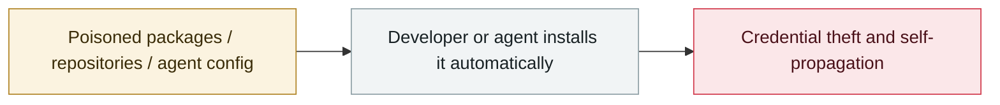

# ClawHavoc campaign

     

## Summary

Koi Security audited **2,857 skills on ClawHub and found 341 malicious ones (about 12%)**, a figure later raised to **824**. The main payload is the macOS infostealer **AMOS (Atomic Stealer)**. Techniques: typosquatting, fake "prerequisite" requirements, reverse shells, reading `.env`; payloads hide inside password-protected archives and obfuscated shell scripts to evade static analysis. OpenClaw then partnered with VirusTotal to add automatic scanning (including LLM-based Code Insight) for every skill

⚠️ **Sources conflict on the malicious count: 341 / 824 / 1,184 / 1,200+, depending on when the audit was run and what it counted**

## Attack chain

## Sources

| # | Source | Link |
|---|---|---|
| 1 | Koi Security | <https://www.koi.ai/blog/clawhavoc-341-malicious-clawedbot-skills-found-by-the-bot-they-were-targeting> |
| 2 | OpenClaw advisory | <https://openclaw.ai/blog/virustotal-partnership> |

## Metadata

| Field | Value |
|---|---|
| Date | `2026-02-01` (raw: 2026-02-01, precision `day`) |
| Kind | Incident `incident` |
| Type | [`SUPPLY`](../../taxonomy/types.md#supply) Supply-chain poisoning |
| Severity | **High** `high` |
| Confidence | **A** — primary source (vendor / victim / law enforcement / official report) |
| Real harm | Yes |
| AI involvement | Confirmed `confirmed` |
| Region | [Global](../../regions/global.md) |
| Archive ID | `2026-02-01-clawhavoc-zhan-yi` |

**Why this classification:** Real incident with a confirmed victim. Rated `high`: real damage is limited in scope, or it is a CVSS 9+ severe flaw, or a capability demonstration of significance. Grading criteria: see [taxonomy/severity.md](../../taxonomy/severity.md) and [taxonomy/confidence.md](../../taxonomy/confidence.md).

## Related

**Topic:** [Agent supply-chain poisoning](../../topics/agent-supply-chain.md)

**Related records:**

- `2026-02-09` [Clinejection](2026-02-09-clinejection.md)   Clinejection
- `2026-03-01` [Hades: a sustained campaign turning AI coding assistants into the attack surface](../2026-03/2026-03-01-hades-campaign-ai-coding-assistants.md)   Hades: a sustained campaign turning AI coding assistants into the attack surface
- `2026-03-24` [Backdoored LiteLLM release](../2026-03/2026-03-24-litellm-backdoored-release.md)   Backdoored LiteLLM release
- `2026-03-30` [Axios npm package compromised](../2026-03/2026-03-30-axios-npm-compromised.md)   Axios npm package compromised

---

[← 2026-02 index](README.md) · [← All records](../../README.md) · [Chinese](../i18n/zh/2026-02/2026-02-01-clawhavoc-zhan-yi.md)

This record is part of the **Orca AI Incident Archive**, licensed [CC BY 4.0](../../LICENSE). Found a factual error or a missing source? [Open an issue or PR](../../CONTRIBUTING.md) — corrections are recorded in the record's revision history, never silently overwritten.
