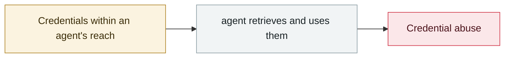

# Infostealers start harvesting OpenClaw configs and gateway tokens

     

## Summary

Commercial infostealers now list **OpenClaw agent config files and gateway tokens** as their own collection targets — agent credentials have formally entered the standard infostealer checklist

## Attack chain

## Sources

| # | Source | Link |
|---|---|---|
| 1 | THN | <https://thehackernews.com/2026/02/infostealer-steals-openclaw-ai-agent.html> |

## Metadata

| Field | Value |
|---|---|
| Date | `2026-02-01` (raw: 2026-02, precision `month`) |
| Kind | Incident `incident` |
| Type | [`CRED`](../../taxonomy/types.md#cred) Credential abuse |
| Severity | **High** `high` |
| Confidence | **B** — research lab or major outlet with checkable detail |
| Real harm | Yes |
| AI involvement | Confirmed `confirmed` |
| Region | [Global](../../regions/global.md) |
| Archive ID | `2026-02-01-openclaw-xin-xi-qie-qu` |

**Why this classification:** Real incident with a confirmed victim. Rated `high`: real damage is limited in scope, or it is a CVSS 9+ severe flaw, or a capability demonstration of significance. Grading criteria: see [taxonomy/severity.md](../../taxonomy/severity.md) and [taxonomy/confidence.md](../../taxonomy/confidence.md).

## Related

**Related records:**

- `2026-02-27` [Check Point publishes two Claude Code CVEs](2026-02-27-check-point-claude-code.md)   Check Point publishes two Claude Code CVEs
- `2026-01-31` [Moltbook database fully open](../2026-01/2026-01-31-moltbook-open-database.md)   Moltbook database fully open
- `2026-03-01` [Hades: a sustained campaign turning AI coding assistants into the attack surface](../2026-03/2026-03-01-hades-campaign-ai-coding-assistants.md)   Hades: a sustained campaign turning AI coding assistants into the attack surface
- `2026-03-24` [Backdoored LiteLLM release](../2026-03/2026-03-24-litellm-backdoored-release.md)   Backdoored LiteLLM release

---

[← 2026-02 index](README.md) · [← All records](../../README.md) · [Chinese](../i18n/zh/2026-02/2026-02-01-openclaw-xin-xi-qie-qu.md)

This record is part of the **Orca AI Incident Archive**, licensed [CC BY 4.0](../../LICENSE). Found a factual error or a missing source? [Open an issue or PR](../../CONTRIBUTING.md) — corrections are recorded in the record's revision history, never silently overwritten.
