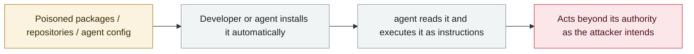

# Clinejection

      

## Summary

**The most elegant agent supply-chain attack to date**: a prompt injection planted in a GitHub issue **title** → manipulated the `claude-code-action` automatic triage flow → arbitrary code execution → poisoned the GitHub Actions cache → stole publishing credentials such as `VSCE_PAT` → **a malicious Cline CLI was actually published**. **Exploited for real, not a PoC**

## Attack chain

## Sources

| # | Source | Link |
|---|---|---|
| 1 | adnanthekhan | <https://adnanthekhan.com/posts/clinejection/#pre-publication> |

## Metadata

| Field | Value |
|---|---|
| Date | `2026-02-09` (raw: 2026-02-09, precision `day`) |
| Kind | Incident `incident` |
| Type | [`SUPPLY`](../../taxonomy/types.md#supply) Supply-chain poisoning · [`IPI`](../../taxonomy/types.md#ipi) Indirect prompt injection |
| Severity | **Critical** `critical` |
| Confidence | **A** — primary source (vendor / victim / law enforcement / official report) |
| Real harm | Yes |
| AI involvement | Confirmed `confirmed` |
| Region | [Global](../../regions/global.md) |
| Archive ID | `2026-02-09-clinejection` |

**Why this classification:** Real incident with a confirmed victim. Rated `critical`: confirmed real damage at the multi-organization / government / critical-infrastructure / supply-chain-worm level, or a first-of-its-kind capability milestone with real victims. Grading criteria: see [taxonomy/severity.md](../../taxonomy/severity.md) and [taxonomy/confidence.md](../../taxonomy/confidence.md).

## Related

**Topic:** [Agent supply-chain poisoning](../../topics/agent-supply-chain.md) · [Zero-click data exfiltration chain](../../topics/zero-click-exfil.md)

**Related records:**

- `2026-02-01` [ClawHavoc campaign](2026-02-01-clawhavoc-zhan-yi.md)   ClawHavoc campaign
- `2026-03-01` [Hades: a sustained campaign turning AI coding assistants into the attack surface](../2026-03/2026-03-01-hades-campaign-ai-coding-assistants.md)   Hades: a sustained campaign turning AI coding assistants into the attack surface
- `2026-03-24` [Backdoored LiteLLM release](../2026-03/2026-03-24-litellm-backdoored-release.md)   Backdoored LiteLLM release
- `2026-03-30` [Axios npm package compromised](../2026-03/2026-03-30-axios-npm-compromised.md)   Axios npm package compromised

---

[← 2026-02 index](README.md) · [← All records](../../README.md) · [Chinese](../i18n/zh/2026-02/2026-02-09-clinejection.md)

This record is part of the **Orca AI Incident Archive**, licensed [CC BY 4.0](../../LICENSE). Found a factual error or a missing source? [Open an issue or PR](../../CONTRIBUTING.md) — corrections are recorded in the record's revision history, never silently overwritten.
