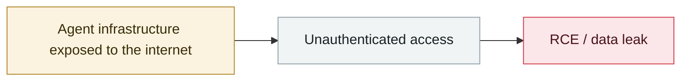

# 15,200 OpenClaw control panels exposed

     

## Summary

SecurityScorecard STRIKE: binds to all network interfaces by default. CVE-2026-25253 (RCE), CVE-2026-25157 (SSH command injection) and CVE-2026-24763 (Docker sandbox escape) are widely unpatched. The agent holds cloud credentials, SSH keys and browser sessions, so a compromise means full loss of control over the host. **About 33.8% of the instances are linked to existing malicious activity (including APT groups)**. Recommendations: upgrade to 2026.2.1+, bind to 127.0.0.1, rotate all API keys

## Attack chain

## Sources

| # | Source | Link |
|---|---|---|
| 1 | CybersecurityNews | <https://cybersecuritynews.com/openclaw-control-panels-exposed/> |

## Metadata

| Field | Value |
|---|---|
| Date | `2026-02-10` (raw: 2026-02-10, precision `day`) |
| Kind | Incident `incident` |
| Type | [`INFRA`](../../taxonomy/types.md#infra) Agent infrastructure exposure |
| Severity | **High** `high` |
| Confidence | **A** — primary source (vendor / victim / law enforcement / official report) |
| Real harm | Yes |
| AI involvement | Confirmed `confirmed` |
| Region | [Global](../../regions/global.md) |
| Archive ID | `2026-02-10-openclaw-kong-zhi-mian-ban` |

**Why this classification:** Real incident with a confirmed victim. Rated `high`: real damage is limited in scope, or it is a CVSS 9+ severe flaw, or a capability demonstration of significance. Grading criteria: see [taxonomy/severity.md](../../taxonomy/severity.md) and [taxonomy/confidence.md](../../taxonomy/confidence.md).

## Related

**Topic:** [Agent infrastructure exposure](../../topics/agent-infra.md)

**Related records:**

- `2026-02-28` [CodeWall breaches McKinsey's internal "Lilli" AI platform](2026-02-28-codewall-breaches-mckinsey-lilli.md)   CodeWall breaches McKinsey's internal "Lilli" AI platform
- `2026-02-25` [OpenClaw ClawJacked (CVE-2026-25253)](2026-02-25-openclaw-clawjacked.md)   OpenClaw ClawJacked (CVE-2026-25253)
- `2026-01-26` [Clawdbot gateways exposed at scale](../2026-01/2026-01-26-clawdbot-wang-guan-gui-mo.md)   Clawdbot gateways exposed at scale
- `2026-01-29` [OpenClaw Control UI WebSocket hijack RCE](../2026-01/2026-01-29-openclaw-control-ui-websocket.md)   OpenClaw Control UI WebSocket hijack RCE

---

[← 2026-02 index](README.md) · [← All records](../../README.md) · [Chinese](../i18n/zh/2026-02/2026-02-10-openclaw-kong-zhi-mian-ban.md)

This record is part of the **Orca AI Incident Archive**, licensed [CC BY 4.0](../../LICENSE). Found a factual error or a missing source? [Open an issue or PR](../../CONTRIBUTING.md) — corrections are recorded in the record's revision history, never silently overwritten.
