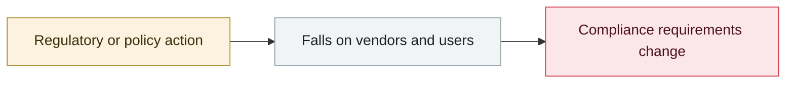

# ChatGPT introduces Lockdown Mode

     

## Summary

Limits outbound network requests and turns off Deep Research / agent mode; high-risk features are also given a uniform "elevated risk" label

## Attack chain

## Sources

| # | Source | Link |
|---|---|---|
| 1 | OpenAI | <https://openai.com/ja-JP/index/introducing-lockdown-mode-and-elevated-risk-labels-in-chatgpt/> |

## Metadata

| Field | Value |
|---|---|
| Date | `2026-02-13` (raw: 2026-02-13, precision `day`) |
| Kind | Policy & regulation `policy` |
| Type | [`GOV`](../../taxonomy/types.md#gov) Governance & policy |
| Severity | **Info** `info` |
| Confidence | **A** — primary source (vendor / victim / law enforcement / official report) |
| Real harm | n/a |
| AI involvement | Confirmed `confirmed` |
| Region | [Global](../../regions/global.md) |
| Archive ID | `2026-02-13-chatgpt-lockdown-mode` |

**Why this classification:** Policy / regulatory action, not counted in incident statistics; `severity` is recorded as `info`. Grading criteria: see [taxonomy/severity.md](../../taxonomy/severity.md) and [taxonomy/confidence.md](../../taxonomy/confidence.md).

## Related

**Topic:** [Defense & governance](../../topics/defense.md)

**Related records:**

- `2026-02-05` [GPT-5.3-Codex rated "High" for cyber capability](2026-02-05-gpt-codex-high.md)   GPT-5.3-Codex rated "High" for cyber capability
- `2026-02-05` [Claude Opus 4.6 finds 500+ zero-days in open-source projects](2026-02-05-claude-opus-kai-yuan-xiang.md)   Claude Opus 4.6 finds 500+ zero-days in open-source projects
- `2026-02-18` [Anthropic, "Measuring AI agent autonomy in practice"](2026-02-18-anthropic-measuring-agent-autonomy.md)   Anthropic, "Measuring AI agent autonomy in practice"
- `2026-02-19` [Microsoft: don't run OpenClaw on ordinary work machines](2026-02-19-openclaw-wei-ruan-pu-tong.md)   Microsoft: don't run OpenClaw on ordinary work machines

---

[← 2026-02 index](README.md) · [← All records](../../README.md) · [Chinese](../i18n/zh/2026-02/2026-02-13-chatgpt-lockdown-mode.md)

This record is part of the **Orca AI Incident Archive**, licensed [CC BY 4.0](../../LICENSE). Found a factual error or a missing source? [Open an issue or PR](../../CONTRIBUTING.md) — corrections are recorded in the record's revision history, never silently overwritten.
