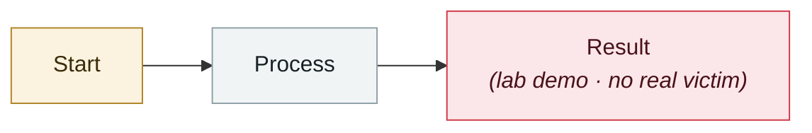

# Boundary Point Jailbreaking (BPJ)

     

## Summary

A fully automated black-box attack that uses **only binary "blocked or not" feedback** plus curriculum learning to optimise an adversarial prefix, exploiting "boundary points" that are sensitive to tiny changes. **It broke the Constitutional Classifiers and the GPT-5 input filters that had survived thousands of hours of red-teaming**, achieving a universal jailbreak. The team notes that because it generates a large number of queries, **per-conversation defences are not enough — batch-level monitoring is needed**

## Attack chain

## Sources

| # | Source | Link |
|---|---|---|
| 1 | UK AISI | <https://www.aisi.gov.uk/blog/boundary-point-jailbreaking-a-new-way-to-break-the-strongest-ai-defences> |
| 2 | arXiv | <https://arxiv.org/abs/2602.15001v2> |

## Metadata

| Field | Value |
|---|---|
| Date | `2026-02-17` (raw: 2026-02-17, precision `day`) |
| Kind | Research demo `research` |
| Type | [`OTHER`](../../taxonomy/types.md#other) Other |
| Severity | **Medium** `medium` |
| Confidence | **A** — primary source (vendor / victim / law enforcement / official report) |
| Real harm | No |
| AI involvement | Confirmed `confirmed` |
| Region | [United Kingdom](../../regions/uk.md) |
| Archive ID | `2026-02-17-boundary-point-jailbreaking-bpj` |

**Why this classification:** Controlled demo by a research lab or vendor, `real_harm: false`; the record marks when the attack surface became public. Rated `medium`: controlled demo, moderate flaw, or an incident limited to a single user / single machine. Grading criteria: see [taxonomy/severity.md](../../taxonomy/severity.md) and [taxonomy/confidence.md](../../taxonomy/confidence.md).

---

[← 2026-02 index](README.md) · [← All records](../../README.md) · [Chinese](../i18n/zh/2026-02/2026-02-17-boundary-point-jailbreaking-bpj.md)

This record is part of the **Orca AI Incident Archive**, licensed [CC BY 4.0](../../LICENSE). Found a factual error or a missing source? [Open an issue or PR](../../CONTRIBUTING.md) — corrections are recorded in the record's revision history, never silently overwritten.
